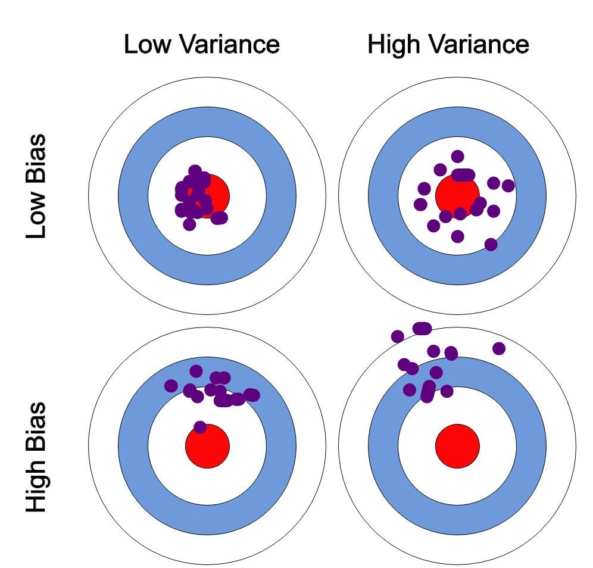
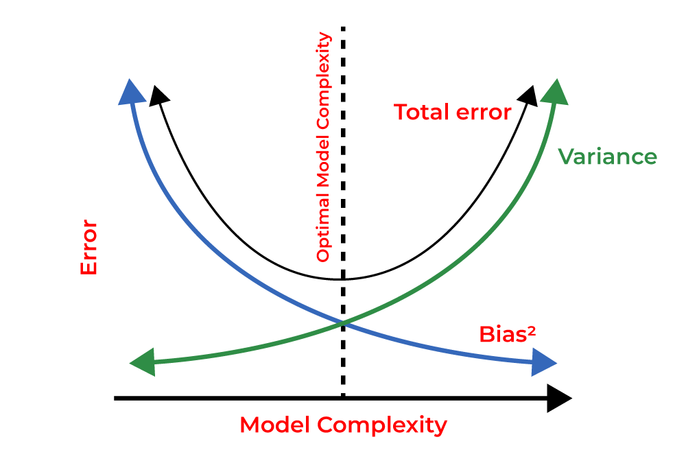
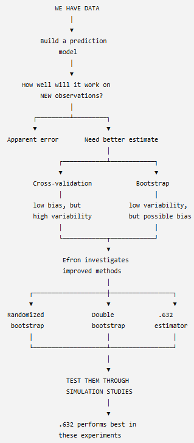
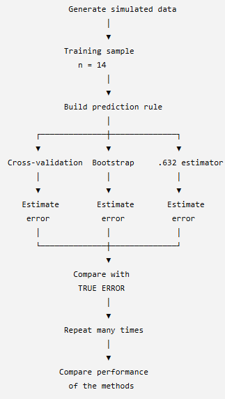

# Simulation Study

## Paper Overview of Simulation Study (Efron 1983)
This section summarizes the simulation study discussed in Estimating the Error Rate of a Prediction Rule: Improvement on Cross-Validation, [@Efron1983].

This study aims to build a prediction rule based on data provided to create a prediction model and estimate the liklihood of the model making an incorrect prediction, which is the error rate, when tested on data it has never seen before. The study leverages statisical techniques such as cross validation, various bootstrapping methods, etc. and compare their results to determine which method gives the best estimate of the true error rate.

## Key Concepts
### Cross Validation:
* Cross-validation is a technique used to estimate how well a prediction model will perform on new, unseen data. It does this by dividing the available data into training and testing portions multiple times, fitting the model using the training portion, and evaluating its performance on the testing portion.
* Therefore Cross Validation:
    - The specific machine learning model is trained using the training data.
    - The trained machine learning model is then tested/evaluated using testing data which is the data it did not train on.
    - **IMPORTANT NOTE:** Seeing how the model works on data it was not been trained on allows us to evaluate how well the model performed. So, within each iteration, the same data used to train the model should not be used to test that version of the model. 
        - Therefore, the data needs to be split into a training dataset and a testing dataset. 
        - A fold of data refers to a chunk/subset of data.
        - The data is divided into k number equally-sized folds. During each iteration, k-1 number of folds of data are used for for training and the remaining 1 fold of data is used for testing. This is referred to a k-fold cross validation.
        - For example, in a 4-fold cross valdiaiton, we divide a dataset up into 4 equally sized folds. We may choose to use the first 75% of the data (first 3 folds of data) to train a particular machine learning model then use the last 25% of the data (last fold of the data) to test the machine learning model. However, how do we know if this selection of data is the best option? what if using the first 25% of the data for testing the model and the last 75% for training the model is better?

        | Iteration | Fold 1 | Fold 2 | Fold 3 | Fold 4 |
        |:-----:|:------:|:------:|:------:|:------:|
        | 1 | Train | Train | Train | **Test** |
        | 2 | Train | Train | **Test** | Train |
        | 3 | Train | **Test** | Train | Train |
        | 4 | **Test** | Train | Train | Train |

        - Cross validation helps identify and evaluate overfitting by using various combinations of data folds for training the model and keeps track of how well the model performed using the corresponding testing data folds. So, instead of splitting a dataset just once into a training set and a testing set, cross validation repeats the process multiple times. 
        - Looks at the average the performance scores from all iterations to get a final accuracy metric.
        - Compares the results across various models where each model sees the exact same folds to detmerine which model works best using the specific fold combination. 
    - **IMPORTANT NOTE:** Model overfitting is a modeling error that occurs when a machine learning model matches its training data too closely, which leads it to simply memorizing the data, random noise, and minor quirks instead of actually learning from the data to idenfity meaningful, true, general patterns.
        - Helps address overfitting concerns by providing a reliable estimate of how well a model performs on unseen data rather than just memorizing the training set.

### Bootstrapping:
* Bootstrapping is a technique that can be used to provide insight into whether a performance eestimator or model statistic may be biased for a given machine learning model. 
* Bootstrapping works by resampling a single dataset repeatedly with replacement (known as sampling with replacement) to estimate the variability, bias, or uncertainty of a statistic or estimator. In Efron's paper, bootstrap methods are used to estimate the error rate of a prediction rule.
* Therefore bootstrapping:
    - Takes a fixed original dataset of n number of observations.
    - Randomly draws a data points from the original dataset with replacement where a single data point from the original dataset may be picked more than once while some data points from the original dataset may not be picked at all. 
    - This process is done until a new dataset is created known as the bootstrapped dataset with the same n number of data points as the original dataset.
    - This process is then repeated multiple times, producing multiple bootstrapped datasets.
    - The statisics for each of the bootstrapped datasets are taken. This could include the mean, median, standard deviation, etc. for each bootstrapped dataset.
    - For simplicity, lets assume we are only considering the mean of each of the boootstrapped datasets. After collecting all the means for all bootstrapped datastes. These means can be plotted onto a histogram which is used to visualize the frequency of a particular measurment or statistic. 
    - This histogram which is a distribtuion of bootstrap statisics, in our case, distribution of bootstrap means, gives us an idea of how much our statistic might vary if we could repeatedly obtain new samples from the same population. 
    - This histrogram can also provide insight into the liklihood of getting something close to the original statisic, in our case the mean, of the original dataset when the experiment is rerun multiple times by looking at the distribution of the histrogram.
    - The standard deviation of the bootstrap distribution of the statistic from the histogram provides an estimate of the standard error of that statistic of the original dataset.
    - We can also determine a bootstrap confidence interval which can be constructed from the distribution of bootstrap estimates. For example, a 95% bootstrap confidence interval provides a range of plausible values for the population parameter based on the bootstrap distribution where The interval contains 95% of the bootstrap estimates.
    - This can allow us to conduct a hypothesis test to determine whether we reject or fail to reject the nu,ll hypothesis. Although this is not the primary use of bootstrapping in Efron's paper.

### Prediction Problem:
* A Prediction problem - is the specific question or task you want to solve.
* A Prediction model - is the mathematical tool or formula used to solve it.
* A Prediction rule - is a specific decision threshold, score cutoff, or constraint derived from a model to classify subjects or take action.

### Error Rate:
* Error rate (True error rate) refers to the likelihood/poercentage of a model to make the incorrect predicition when tested on data it was not trained on.
* Apparent error rate refers to the likelihood/poercentage of a model to make the incorrect predicition when tested on the same data it already trained on. The apparemnt error often gives misleading results that are too optimistic since the model has already "seen the answer before" so it did not actually "learan the material."

### Bias Vs. Variance:
* Bias measures how far off a model's average predictions are from the correct values. Bias is the error from making oversimplified assumptions, leading to underfitting. 
    - Underfitting refers to when the model is too simple to capture the underlying or key patterns in the data, resulting in poor performance on both training and testing datasets.
* Variance measures how much a model's predictions change if you train it on a different data subset. Variance is the error from the model being too sensitive to small changes in training data, leading to overfitting. 
    - Overfitting refers to when the model learns the training data too well, is overly complex, sensitive, and flexible, rsulting in the memorization of random noise and minor quirks instead of the true underlying or key patterns.
* For a good and reliable model, an optimal balance between simplicity and complexity, and thus, a low bias and low variance is required. 
    - As model complexity increases, bias goes down and variance goes up.
    - As model simplicity increaes, bias goes up and variance goes down.

### ANOVA Decompostion:
* ANOVA decomposition is sued to determine the origin of variation in data by separating the total variation into between-group and within-group components. Efron's study examines different sources of variation and error that affect estimates of prediction error.

### Fisher's Linear Discriminant:
* Fisher's linear discriminant is a classification method used as a prediction rule where given an observation or data point, decide which group/class it belongs to. 
* Fisher's linear discriminat tries to find a linear boundary that separates the two classes as well as possible.

### Logistic Regression:
* Logistic regression is used to predict the probability of a categorical outcome, such as a binary outcome. Enfron's study looks into how can we estimate how well a prediction rule will perform on new, unseen observations.

## Simulation Study Procedure Defined in Efron 1983
### Central Question of Study:
* Efron aims to estimate the likelihood of a model making the inccorect prediction when tested on data it has not been trained on, refered to as the true error rate by comparing methods to identify which method is the best estimate of the true error rate. 
* In this simulaiton study, Efron already knows the true error rate since he knows how the data is generated and is trying to determine how accurate the models are by seeing which model is the best at estimating the true error rate.

### Models/Techniques Used:

* **Cross Validation:**
    - Efron used Leave-One-Out Cross-Validation (LOOCV), in which each observation is removed from the dataset one at a time. A prediction rule is then fitted using the remaining observations and used to predict the observation that was left out. The prediction is recorded as either correct or incorrect, and this process is repeated for every observation. The proportion of incorrect predictions provides an estimate of the model's prediction error on observations that were not used to fit the prediction rule.

    - **Example to visualize the LOOCV technique:** Suppose we have four observations belonging to one of two classes, 0 or 1. In each round of LOOCV, one observation is held out as the test observation, while the remaining three observations are used to fit the prediction rule. The fitted rule then predicts the class of the held-out observation.

    | Iteration | Training Data | Testing Data | Predicted | Correct?  | Error |
    | --------- | ------------- | ------------ | --------- | --------- | ----: |
    | 1         | 2, 3, 4       | **1**        | 0         | No        |     1 |
    | 2         | 1, 3, 4       | **2**        | 1         | Yes       |     0 |
    | 3         | 1, 2, 4       | **3**        | 1         | No        |     1 |
    | 4         | 1, 2, 3       | **4**        | 0         | Yes       |     0 |

    The LOOCV error rate is calculated as the proportion of incorrect predictions across all four iterationss:
    $$
    \text{LOOCV Error Rate} = \frac{1 + 0 + 1 + 0}{4} = 0.50
    $$
    Therefore, the estimated error rate using LOOCV is **50%**.

* **Ordinary Bootstrap:**
    - Efron used ordinary boostrapping to create new aritifical datasets by randomly sampling from the original dataset with replacement where the original dataset is used to represent the population. 

* **Randomized Bootstrap:**
    - Efron used a modified version of the ordinary bootstrap which uses the same process of an orindary bootstrap but the only idfference is that the observations are not treated as having completely certain classifications.

* **Double Bootstrap:**
    - Efron used double bootstrap to help correct the downward bias found in the ordinary bootstrap. He did this by taking the bootstrap of the original ordrinary bootstrap. 

* **.632 Estimator:**
    - Efron used the .632 estimator which is a bootsrapping method that performs the same rpocedures as an ordinary bootstrap where 63.2% of the original obersevations appear in the bootstrap sample and 36.8% of the original oberservations are left out of the bootstrap sample. The .632 estimator commbine the apparent error and the bootstrap error, giving more weight to the bootstrap error which Efron originally found to have a downward bias.
    - **Example to visualize the .632 Estimator technique:** Think of the .632 estimator as balancing two imperfect estimates: the apparent error may be too optimistic because the model has already seen the data, while the bootstrap error is based on observations the model did not see. The .632 estimator therefore gives more weight to the bootstrap error while still incorporating the apparent error. Consider an exmaple where the apparent error rate is found to be 10% and the ordinary bootstrap error rate is foudn to be 25%. The rror rate of the .632 estimator is calculated using the following formula:

$$
\widehat{Err}_{.632}
=
0.368(\text{apparent error})
+
0.632(\text{bootstrap error})
$$

So the .632 estimator gives:

- **36.8% weight** to apparent error
- **63.2% weight** to bootstrap error

For example, suppose:

$$
\text{Apparent error} = 10\%
$$

and

$$
\text{Bootstrap error} = 25\%
$$

Then:

$$
\widehat{Err}_{.632}
=
(0.368)(10\%) + (0.632)(25\%)
$$

$$
= 3.68\% + 15.8\%
$$

$$
= 19.48\%
$$
Therefore, the .632 estimator gives an estimated prediction error of **19.48%**.

### Sampling Experiements Used:
* **Sampleing Experiment #1 - (2, 14):**
    - 2 predictors - 2 independent variables
    - 14 observations - sample size of 14
    - 100 trials - the experiement was repreated 100 times
    - For example: visualize the data as a matrix

    | Observation | Variable 1 $(X_1)$ | Variable 2 $(X_2)$ | Class $(Y)$ |
    | ----------- | -----------------: | -----------------: | ----------- |
    | 1           |                 22 |                 35 | A           |
    | 2           |                 31 |                 52 | B           |
    | 3           |                 27 |                 41 | A           |
    | ...         |                ... |                ... | ...         |
    | 14          |                 45 |                 75 | B           |

* **Sampleing Experiment #2 - (2, 20):**
    - 2 predictors - 2 independent variables
    - 20 observations - sample size of 20 (allows Efron to see what happens when sample size increases)
    - 100 trials - the experiement was repreated 100 times
    - For example: visualize the data as a matrix

    | Observation | Variable 1 $(X_1)$ | Variable 2 $(X_2)$ | Class $(Y)$ |
    | ----------- | -----------------: | -----------------: | ----------- |
    | 1           |                 22 |                 35 | A           |
    | 2           |                 31 |                 52 | B           |
    | 3           |                 27 |                 41 | A           |
    | ...         |                ... |                ... | ...         |
    | 20          |                 56 |                 67 | A           |

* **Sampleing Experiment #3 -(5, 14):**
    - 5 predictors - 5 independent variables (allows Efron to see what happens when the number of predictors increase)
    - 14 observations - sample size of 14 
    - 100 trials - the experiement was repreated 100 times
    - For example: visualize the data as a matrix

    | Observation | $(X_1)$ | $(X_2)$ | $(X_3)$ | $(X_4)$ | $(X_5)$ | Class |
    | ----------- | ------: | ------: | ------: | ------: | ------: | ----- |
    | 1           |     ... |     ... |     ... |     ... |     ... | A     |
    | 2           |     ... |     ... |     ... |     ... |     ... | B     |
    | 3           |     ... |     ... |     ... |     ... |     ... | A     |
    | ...         |     ... |     ... |     ... |     ... |     ... | ...   |
    | 14          |     ... |     ... |     ... |     ... |     ... | A     |

* **Sampleing Experiment #4 - (5, 20):**
    - 5 predictors - 5 independent variables (allows Efron to see what happens when the number of predictors increase)
    - 20 observations - sample size of 20 (allows Efron to see what happens when sample size increases)
    - 100 trials - the experiement was repreated 100 times
    - For example: visualize the data as a matrix

    | Observation | $(X_1)$ | $(X_2)$ | $(X_3)$ | $(X_4)$ | $(X_5)$ | Class |
    | ----------- | ------: | ------: | ------: | ------: | ------: | ----- |
    | 1           |     ... |     ... |     ... |     ... |     ... | A     |
    | 2           |     ... |     ... |     ... |     ... |     ... | B     |
    | 3           |     ... |     ... |     ... |     ... |     ... | A     |
    | ...         |     ... |     ... |     ... |     ... |     ... | ...   |
    | 20          |     ... |     ... |     ... |     ... |     ... | B     |

* **Sampleing Experiment #5 - Gong:**
    - 4 predictors
    - 20 observations
    - 171 trials
    - logistic regression
    - forward stepwise variable selection

### Simulation Study Step-by-Step:
1. Efrons uses a sampling experiemtn to generate a sample of data to use for the simulation study.
2. Efron generates data according to a specified probability model and uses the training data to construct a classification rule which is the Fisher's linear discriminant, and this represents the prediction rule which works by seperating observations or data points into their respective classes. It cis then used to predict the class of a new observation. 
3. The specific method such as cross validation, bootstrapping, etc., is then used to test how well that classifier predicts unseen observations.
4. Efron then studies how well each method is at estimating the classifier's true error rate.
5. Efron then compares the error rates from the different methods like cross validation, bootstrapping, etc. and determines which method is the best estimator of the true error rate.
6. He then repeats the experiment 100 times.

### Results:
* **Cross Validation Findings:**
    - Efron finds that cross-validation is fairly unbiased, meaning that its estimated error tends to be close to the true prediction error on average or that its results tend to be around the correct answer. However, cross validation is highly variable for small sample sizes of data. With fewer observations, individual data points can have a larger influence on the fitted prediction rule, causing the estimated error rate to vary more from one sample to another. Therefore, while cross-validation can provide a relatively accurate estimate on average, a single cross-validation estimate may not be very stable.

* **Ordinary Bootstrapping Findings:**
    - Efron finds that ordinary bootstrapping has relatively low variability but has a significant downward bias, meaning, the model consistently underestimates the true error rate. 

* **Randomized bootstrap Findings:**
    - The error rate was reduced compared to the ordinary bootstrap and was foudn to be the second-best method overall in the sampling experiments.

* **Double bootstrap Findings:**
    - The double bootstrap successfully corrected the ordinary bootstrap's bias, although its MSE was about the same as the ordinary bootstrap.

* **.632 Estimator Findings:**
    - The .632 estimator performed best in the sampling experiments. However, this method had the weakest theoretical justification and therefore recommended it with caution pending additional research.

## Efron's Simulation Study Design

## Student Presentation & Simulation Study Sketch
I will replicate one of the simulation experiments from Efron's paper, focusing on the (2,14) experiment. In this experiment, Efron considers a prediction problem with two predictor variables and a training sample of 14 observations. I will generate data according to the simulation setup described in the paper, construct the prediction rule, and estimate its error rate using the methods discussed by Efron. I will then compare the estimated error rates with the true error rate across repeated simulations to investigate how accurately each method estimates prediction error.

