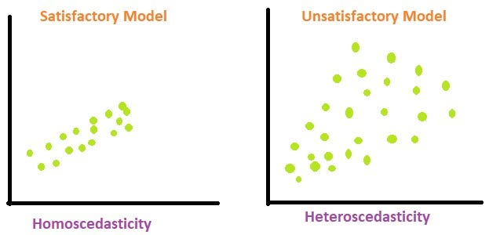

# Ordinal Regression

* **Article Titie:** Modeling Continuous Response Variables Using Ordinal Regression
* **Author:** Qi Liu, Bryan E. Shepherd, Chun Li, Frank E. Harrell Jr.

Modeling Continuous Response Variables Using Ordinal Regression [@liu2017] introduces the concept of Ordinal Regression.

## Motivation:
* A **continuous variable/measurement** is also an **ordered variable/measurement.**
* Instead of trying to guess the exact shape of the outcome distribution or the exact transformation needed like in linear regression, we can model the probability that the **continuous outcome is below any particular value.**
* Therefore, ordinal regression does not assume a shape for the outcvome distribution.

## What does Ordinal Mean?
* **Ordinal** - means that there is an order to the possible outcomes.
* Consider an example where our outcome is to determine health improvement in a patient:
    * For a categorical variable where values are ordered, **(Ordinal Categorical Discrete Variable)**:
        - For example: Poor < Fair < Good < Excellent
    * One can intuitively understand that Poor < Fair. 
    * However, we don't necessarily know that the difference between Poor and Fair is numerically equal to the difference between Good and Excellent.
    * The jump from Poor to Fair might not represent the same amount of health improvement as Good to Excellent.
* Consider an example where our outcome is to determine the weight in a patient:
    * For a continuous numerical variable, values are ordered, **(Ordinal Numerical Continuous Variable)**, but they also have numerical distances.
        - For example: 120 < 135 < 190 < 230 (in lb)
    * The differences or distances between each value have a numerical meaning
* **The main insight of the paper is Ordinal Regression uses ordering without assuming anything about the shape of the outcome distribution**.
* **Ordinal regression allows us to provide meaning to ordered outcomes after a transformation has been performed**.

## What Problem is the Paper Addressing
* Suppose we want to predict a continuous numerical outcome $Y_i$ = blood pressure, and predictor variables $X_i$, such as age, height, gender, etc.
* One could use **Linear Regression** to predict $Y_i$ = blood pressure:
$$ Y_i = \beta_0+\beta_1X_{i1}+\beta_2X_{i2}+\cdots+\epsilon_i. $$
* **The problem: Linear regression makes assumptions about the distribution of Y**
    - Assumption #1: Linearity of the conditional mean - The average value of Y, given X, is a linear function of $X_i$. 
    $$ E(Y_i|X_i) = \beta_0+\beta_1X_{i1} $$
    - Assumption #2: Homoscedasticity - The amount of variability around the regression line is assumed to be roughly constant across values of $X_i$ where $σ^2$ does not depend on $X_i$.
    $$ Var(\epsilon_i∣X_i)=σ^2​ $$
    
    

    - Assumption #3: Errors are independent 
    $$ \epsilon_1, \epsilon_2 ,  \epsilon_3, \cdots, independent $$
    - Assumption #4: The errors have mean zero - Model does not systematically overpredict or underpredict the target variable
    $$ E(Y_i|X_i) = 0 $$
    - **Assumption #5: Appropriate transformation choice for Y**
        * Assume $Y_i$ is heavily-rigth skewed. One might take the log($Y_i$) such that:
        $$ log(Y_i) = \beta_0+\beta_1X_{i1}+\beta_2X_{i2}+\cdots+\epsilon_i. $$
        * But how do we know that logarithm is the right transformation? What about $Y_i^2$, $\sqrt{Y_i}$, etc. **The correct transformation is often unknown.**
* **To avoid arbitrarily picking a linear transformation**, the paper says to use the **Cumulative probability model (CPM)**.

## Cumulative Probability Model (CPM)

Also called the **Cumulative Link Model**

The **cumulative probability model (CPM)** is a type of **Ordinal Regression Model**. Instead of modeling the outcome $Y$ (a continuous ordinal variable) directly, it models the probability that $Y$ is at or below a cutoff $y$ (which is a specific value we specify) given predictors $X$.
$$ P(Y≤y∣X) $$
The CPM can be computed every every possible cutoff value $y$ which is the **conditional cumulative distribution function (CDF)** of an outcome given a set of covariates. Therefore, it models the whole distribution of the outcome.
$$ F⁡(y|X) = P(Y ≤ y|X) $$

::: {.callout-note title="Vocabulary Note"}
* **Covariates** - are a set of predictors $X$ that may affect the outcome $Y$ that we are measuring. 
::: 

### Mathematically Deriving the CPM:

Consider the **Linear Transformation Model** which is a regression model where for an outcome $Y$ which is not assumed to be linear. There is some unknown increasing **monotone transformation** $H$ which follows a linear model that is applied to the outcome with errors that have a known distribution (we define the distribution of the error terms).
$$
\begin{aligned}
& Y = H(Y^*) \\
& Y^* = \beta^\top X + \epsilon \\
& Y = H(\beta^\top X + \epsilon) \\
& \epsilon \sim F_\epsilon
\end{aligned}
$$

::: {.callout-note title="Vocabulary Note"}
* **Monotone transformation/Monotone function** - transformation or function $H$ which preserves the order.
::: 

::: {.callout-note title="Defining Variables"}

* $Y$ - Outcome/Continuous ordered predicted variable (increasing function).
* $Y^*$ - Unobserved continuous variable (underlying/hidden relationship function of the data).
* $X$ - Vector of predictor variables
* $y$ - Cutoff threshold value
* $H$ - Unknown monotone increasing function/transformation. 
    - Its shape is nonparametric. So, $H(.)$ is a nonparametric transformation or shift from the baseline distribution.
* $\epsilon$ - Random error. Assumed to come from some distribution. We specify this.
    - For ex. Normal error distribution $ϵ \sim N(0,1)$ → probit link
* $F_\epsilon$ - Distribution function
* $\beta$ - Vector of the regression coefficients which describe how predictors shift the baseline distribution.
* $\alpha(y)$ - Monotone function of the outcome threshold y estimated directly from the data, this captures the marginal distribution without assuming normality or any other parametric form. It is a different intercept for each cutoff threshold vlaue $y$

:::

Vectors of predictor variables, regression coefficients, and transpose regression coefficients in matrix form:
$$
X =
\begin{bmatrix}
X_1 \\ \vdots \\ X_n
\end{bmatrix},
\qquad
\beta =
\begin{bmatrix}
\beta_1 \\ \vdots \\ \beta_n
\end{bmatrix},
\qquad
\beta^T =
\begin{bmatrix}
\beta_1 \cdot \cdot \cdot \beta_n
\end{bmatrix}
$$
Therefore, the linear transformation can be epxressed via the matrices:
$$
\begin{bmatrix}
y_1 \\
\vdots \\
y_n
\end{bmatrix}
=
\begin{bmatrix}
\beta_1 & \cdots & \beta_n
\end{bmatrix}
\begin{bmatrix}
X_1 \\
\vdots \\
X_n
\end{bmatrix}
+
\begin{bmatrix}
\epsilon_1 \\
\vdots \\
\epsilon_n
\end{bmatrix}
→ 
Y^* = \beta^T X + \epsilon_i
$$
The cummulative CDF of Y can be defined as:
$$
\begin{aligned}
& F(y \mid X) = P(Y \leq y \mid X) \\
& F(y \mid X) = P\left[H(\beta^\top X + \epsilon) \leq y \mid X\right] \\
& F(y \mid X) = P\left[\epsilon \leq H^{-1}(y) - \beta^\top X \mid X\right] \\
& F(y \mid X) = F_{\epsilon}\left[H^{-1}(y) - \beta^\top X\right]
\end{aligned}
$$

A probability is constrained between between 0 and 1, but the linear part $(\alpha(y) − \beta^TX)$ can be any number. Where $\alpha(y) = H^{-1}(y)$ is the transformation/intercept function. So we apply a **link function** $G = F_\epsilon^{-1}$ by taking the inverse of $F_𝜖$ for both sides of the equation to stretch the probability onto the whole number line so that it can be written as a linear model.
$$
\begin{aligned}
& F_\epsilon^{-1}\left[P(Y \leq y \mid X)\right] = F_\epsilon^{-1}\left[F_\epsilon(H^{-1}(y) - \beta^\top X)\right] \\
& F_\epsilon^{-1}\left[P(Y \leq y \mid X)\right] = H^{-1}(y) - \beta^\top X \\
& G\left[P(Y \leq y \mid X)\right] = H^{-1}(y) - \beta^\top X \\
& G\left[P(Y \leq y \mid X)\right] = \alpha(y) - \beta^\top X
\end{aligned}
$$

::: {.callout-note title="Vocabulary Note"}
* **Link Function** - is simply a mathematical function that transforms a probability into a scale that can be modeled using a linear predictor. It is a transformation function using some underlying distribution assumption. 
* **Link** - connects the probability we're interested in to the scale on which we can use a linear predictor.
::: 

The CPM is the linear transformation model in another parameterized form:
$$ 
P(Y≤y∣X) → \text{link function G} → 
\underbrace{G\left[P(Y \leq y \mid X)\right]}_{\text{link-transformed probability}}
=
\underbrace{\alpha(y)}_{\text{cutoff-specific intercept}} - \underbrace{\beta^T X}_{\text{effect of predictors}} 
$$

### Relation Between the CPM and Being Semiparametric:

A convenient property of this model is that it uses only the **order** of the outcome $Y$. Because $H$ is increasing, applying any monotonic transformation to $Y$ leaves the model's results unchanged, so we never have to choose a transformation ourselves.

The @tbl-transformations shows the transformations $\alpha(y) = H^{-1}(y)$ that a researcher might otherwise have to pick. The CPM estimates $\alpha(y)$ directly.

| Transformation of $Y$: $\alpha(y) = H^{-1}(y)$ | Resulting regression |
|:---------------|:-------------|
| $\alpha(y) = y$ (none) | Ordinary linear regression |
| $\alpha(y) = \log(y)$ | Log-linear regression |
| $\alpha(y) = \text{Box-Cox}(y)$ | Box-Cox regression |
| $\alpha(y)$ unknown | The CPM, which estimates the transformation from the data |

: Possible transformations of the outcome {#tbl-transformations} 

As y gets bigger, the probability of being at or below y goes up, so $\alpha(y)$ must increase too (The CDF increeases). $\alpha(y)$ is the **baseline link-transformed CDF**. For cases when $X = 0$, The $\beta^T X$ term vanishes.

$$G\left[P(Y \leq y \mid X=0)\right] = \alpha(y)$$
Since $\alpha(y)$ must rise as $y$ rises, the $\alpha(y)$ term is described as **nonparametric** where we observe $\alpha_1 \le \alpha_2 \le \dots \le \alpha_n$.

The CPM $G\left[P(Y \leq y \mid X)\right] = \alpha(y) - \beta^\top X$ is **semiparametric**:

* $\beta^T X$ is **parametric**: a finite set of coefficients describing the effect of the predictors.
* $\alpha(y)$ is **nonparametric**: an unspecified increasing function estimated from the data.
* The link function $G$ is chosen by the analyst and determines the assumed error distribution.

### Choosing the Link Function:

Recall that the link function is $G = F_\epsilon^{-1}$. This means choosing a link function is the same as choosing the distribution of the errors $\epsilon$ on the transformed scale. @tbl-links lists the most common choices.

| Name | Link function $G(p)$ | Error distribution | CDF $F_\epsilon(y)$ |
|:-----|:---------------------|:-------------------|:--------------------|
| logit | $\log\left[\dfrac{p}{1-p}\right]$ | Logistic | $\dfrac{\exp(y)}{1+\exp(y)}$ |
| probit | $\Phi^{-1}(p)$ | Normal | $\Phi(y)$ |
| loglog | $-\log\left[-\log(p)\right]$ | Extreme value type 2 (Gumbel maximum) | $\exp\left[-\exp(-y)\right]$ |
| cloglog | $\log\left[-\log(1-p)\right]$ | Extreme value type 1 (Gumbel minimum) | $1-\exp\left[-\exp(y)\right]$ |

: Commonly used link functions and their corresponding error distributions. {#tbl-links}

* **Each row is one assumption about the error distribution.** The **CDF** column is $F_\epsilon$, and the **link function** column is its inverse, $G = F_\epsilon^{-1}$.
    * **Example (logit):** If the errors are logistic, then $p = F_\epsilon(y) = \dfrac{e^y}{1+e^y}$. Solving for $y$ gives $y = \log\left(\dfrac{p}{1-p}\right)$, which is the logit link.
* **Symmetric assumptions depend on error distribution.** 
    * The logit and probit assume symmetric, bell-shaped errors. The loglog and cloglog assume skewed errors, skewed in opposite directions.
* **Interpretation of $\beta$ depends on the link.** 
    * With the logit link, $\beta$ is a log-odds ratio. With the cloglog link, $\beta$ is a log-hazard ratio.
* **The transformation $\alpha(y)$ is left unspecified, but the link $G$ is not.**

## Model Demonstration in Code - Single Dataset Evaluation of the CPM:
**Goal:** build one simulated dataset, fit the ordinal regression cumulative probability model (CPM) on part of it, and then measure how well it predicts the part it has never seen.

::: {.callout-note title="Vocabulary Note"}
* **Training set** - the portion of the data the model ;earns from.
* **Test set** - the portion of the data set that the model is not trained on. We use it afterward to test the model see how the model does on new observations it has not seen before. This is called **out-of-sample performance**.
* **Prediction rule** - a specific threshold/cutoff derived from a model to classify datapoints. It turns predictor values $X$ into a prediction. A linear regression has one prediction rule which is a fitted line. The CPM has several prediction rules, because it estimates the whole conditional distribution: we can read off a mean, a median, a probability, etc.
:::

### Step 1: The Data-Generating Process

Because we simulate the data, we get to be "the master of the universe": we pick the true relationship, and later we can check how close the model gets to it. This is the same structure as the paper's linear transformation model:

$$
Y^* = \beta^\top X + \epsilon, \qquad \epsilon \sim N(0,1), \qquad Y = H(Y^*) = \exp(Y^*)
$$

* **Three predictors:**
    * $X_1 \sim \text{Bernoulli}(0.5)$: a binary variable, the household head has a bachelor's degree
        - X₁ = 1 is yes with probability of p = 0.5
        - X₁ = 0 is no with probability of p = 0.5
    * $X_2, X_3 \sim N(0,1)$: two continuous variables, $X_2$ is the local unemployment rate and $X_3$ is the household head's years of work experience respectively
* **Outcome:** 
    * $Y$ is a skewed, positive variable for the annual household income, measured in units of $50,000.
* **True coefficients:** $\beta = (1.0,\,-0.5,\,0.5)$.
    * $\beta_1 = 1.0$: having a degree pushes income **up**.
    * $\beta_2 = -0.5$: a **higher** local unemployment rate pushes income **down**.
    * $\beta_3 = 0.5$: **more** work experience pushes income **up**.
* **Why $H(y)=\exp(y)$?** It makes the outcome $Y$ right-skewed, just like real income. A plain linear regression on $Y$ would be a poor fit because the *correct transformation* is $\log(Y)$, a very common choice for income. The CPM is never told this; it has to discover the transformation from the data.

Because we know the truth, we can write down the *exact* answers that any model is trying to estimate. Since $Y = \exp(\beta^\top X + \epsilon)$:

| Quantity | True value |
|:---------|:-----------|
| Median of $Y \mid X$ | $\exp(\beta^\top X)$ |
| Mean of $Y \mid X$ | $\exp(\beta^\top X + \tfrac{1}{2})$ (a log-normal mean, with $\sigma=1$) |
| $P(Y > c \mid X)$ | $1 - \Phi\left(\log c - \beta^\top X\right)$ |

: True conditional summaries under this data-generating process {#tbl-truth}

```{python}

#| label: step1-dgp

import numpy as np
from scipy.optimize import minimize
from scipy.stats import norm, kstest
import matplotlib.pyplot as plt

TRUE_BETA = np.array([1.0, -0.5, 0.5])  # true coefficients of the data-generating process

def simulate_data(n, beta=TRUE_BETA, rng=None):
    """Simulate n households: returns the predictor matrix X (n x 3) and outcome y (n,)."""
    rng = np.random.default_rng() if rng is None else rng
    x1 = rng.binomial(1, 0.5, size=n).astype(float)    # bachelor's degree: 1 = yes, 0 = no
    x2 = rng.normal(0, 1, size=n)                      # local unemployment rate 
    x3 = rng.normal(0, 1, size=n)                      # years of work experience 
    X = np.column_stack([x1, x2, x3])                  # one row per household, one column per predictor (income)
    eps = rng.normal(0, 1, size=n)                     # random error, N(0,1)
    ystar = X @ beta + eps                             # hidden Y* = beta'X + error
    y = np.exp(ystar)                                  # observed Y = H(Y*) = exp(Y*)
    return X, y

rng = np.random.default_rng(2026)   # fixed seed so the results are reproducible
X, y = simulate_data(600, rng=rng)  # runs the data-generating process where n = 600 households

print(f"y: min={y.min():.2f}  median={np.median(y):.2f}  mean={y.mean():.2f}  max={y.max():.2f}")

```

Notice that the mean is noticeably larger than the median and the maximum is far out in the tail. That is what right-skew looks like.
  
* Smallest household income: 0.03 × $50,000 = $1,500 
* Mean income: 3.64 × $50,000 = $182,000
* Median income: 1.56 × $50,000 = $78,000
* Largest household income: 37.98 × $50,000 ≈ $1.9 million

Refer to the Diagram below. The left panel show the distribution of the household income data. The right panel shows $\log(y)$, which is exactly the hidden $Y^*$ (since $Y = \exp(Y^*)$). On that scale the distribution is a symmetric bell shape. That symmetric scale is what the CPM has to uncover on its own.

```{python}

#| label: fig-skew
#| fig-cap: "Left: income is right-skewed, so the mean (dashed) is pulled above the median (dotted). Right: on the log scale the distribution is roughly symmetric."
#| code-fold: true

fig, axes = plt.subplots(1, 2, figsize=(10, 4))

axes[0].hist(y, bins=40, edgecolor="white")
axes[0].axvline(np.median(y), color="k", ls=":",  lw=2, label=f"median = {np.median(y):.2f}")
axes[0].axvline(y.mean(),     color="r", ls="--", lw=2, label=f"mean = {y.mean():.2f}")
axes[0].set_xlabel("y (income, in $50,000 units)")
axes[0].set_ylabel("number of households for bin size 40")
axes[0].set_title("Income (right-skewed)")
axes[0].legend()

axes[1].hist(np.log(y), bins=40, edgecolor="white")
axes[1].axvline(np.median(np.log(y)), color="k", ls=":",  lw=2, label="median")
axes[1].axvline(np.log(y).mean(),     color="r", ls="--", lw=2, label="mean")
axes[1].set_xlabel("log(y)")
axes[1].set_title("log(income) (roughly symmetric)")
axes[1].legend()

fig.tight_layout()
plt.show()
```

### Step 2: Train/Test Split

If we judged the model on the same data it learned from, it could look great simply because it memorized quirks of that sample. So we randomly set aside 30% of the observations as a test set. The model never sees them during fitting.

```{python}

#| label: step2-split

idx = rng.permutation(len(y))       # shuffle the row numbers 0..599 before splitting the data
n_train = int(0.7 * len(y))         # 420 rows for training (70% for training, 30% for testing)
train_idx, test_idx = idx[:n_train], idx[n_train:]

X_train, y_train = X[train_idx], y[train_idx]
X_test,  y_test  = X[test_idx],  y[test_idx]

print(f"training rows: {len(y_train)}   test rows: {len(y_test)}")
```

### Step 3: Fit the CPM on the Training Set

We use the probit link. Recall, the **link function** is a translator between probabilities and the linear translation the model is built on. The **probit link** is the version of that translation that **assumes normally distributed errors**. which matches our true $N(0,1)$ errors:

$$
P(Y \le y \mid X) = \Phi\left(\alpha(y) - \beta^\top X\right)
$$

::: {.callout-note title="Review of the Probit Link"}
* The **probit link** is Φ⁻¹, the **inverse of the standard normal CDF.**
    - $Φ$ (the normal CDF) takes any number z and returns the probability that a standard normal value is at or below z.
    - $Φ⁻¹$ (probit) goes the other way: it takes a probability and returns the z-score that corresponds to it.
* Probit stretches probabilities, which are trapped between 0 and 1, onto the whole number line, so they can match the formula. The model says:
    - $Φ⁻¹[P(Y ≤ y | X)] = α(y) − βᵀX$
* and applying Φ to both sides gives the form:
    - $P(Y ≤ y | X) = Φ(α(y) − βᵀX)$
:::

**What the model has to estimate**

* $\beta$: now a vector of **3** numbers instead of a single number.
* $\alpha_1 < \alpha_2 < \dots < \alpha_{n-1}$: one intercept for every observed training outcome (the paper's nonparametric $\alpha(y)$). The last one, $\alpha_n$, is fixed at $+\infty$ so the CDF reaches 1 at the largest observed $y$.

**Determining maximum likelihood.** Imagine sorting the households by $Y$. Household $i$'s outcome sits in the slice between cutoffs $\alpha_{i-1}$ and $\alpha_i$, so under the model their data has probability:

$$
\Phi(\alpha_i - \beta^\top x_i) - \Phi(\alpha_{i-1} - \beta^\top x_i).
$$

The **likelihood** multiplies these probabilities over all households. We search for the $\beta$ and $\alpha$ values that make the observed data as probable as possible (maximum likelihood).

**To fit the model we need:**

- 1. **Create an optimizer.** The optimizer (a searching algorithm) tries many candidate values for β and the α's and keeps improving until it finds the ones that make the training data most probable. The α's are cutoffs tied to the sorted incomes, so they must go up: α₁ < α₂ < α₃ < ... to be a valid CDF. But the optimizer doesn't know that rule. It treats every number as free and might try something like α₂ = −3 right after α₁ = 2. 
- 2. **Keeping the intercepts increasing.** The optimizer is free to try any numbers, but the $\alpha$'s must be ordered. Don't let the optimizer choose the α's directly. Let it choose:
    * θ₀, any number, which becomes the first α;
    * θ₁, θ₂, ..., any numbers, which become the gaps between consecutive α's.
    * The code turns each θ into positive gaps $e^{\theta_1}, e^{\theta_2}, \dots$, no matter what number goes in. The α's are then rebuilt by adding up gaps: $\alpha_j = \theta_0 + \sum e^{\theta_m}$.
        - α₁ = θ₀
        - α₂ = θ₀ + e^θ₁
        - α₃ = θ₀ + e^θ₁ + e^θ₂
- 3. **An analytic gradient.** The gradient tells the optimizer which direction improves the likelihood. Giving it the exact formula (instead of letting it guess numerically) makes fitting hundreds of intercepts very fast.
- 4. **A stable probability formula** Each household's likelihood contribution is Φ(upper) − Φ(lower), the probability of landing in a thin slice. When both values are far out in the upper tail, Φ is essentially 1 for both, and the computer can only store a limited number of digits. For example, Φ(10) and Φ(11) both round to exactly 1.0, so their difference comes out as 0. Then the log of that is log(0) = −∞, which breaks the search. Use the survival function, sf(z) = 1 − Φ(z), the probability of being above z.

```{python}

#| label: step3-fit
#| code-fold: true

def _interval_prob(upper, lower):
    """Phi(upper) - Phi(lower), computed in a numerically stable way."""
    return np.where(lower > 0,
                    norm.sf(lower) - norm.sf(upper),
                    norm.cdf(upper) - norm.cdf(lower))

def _unpack(params, p):
    """Split the optimizer's vector into beta and the increasing alphas."""
    beta = params[:p]
    theta = params[p:]
    gaps = np.exp(theta[1:])                                           # positive gaps
    alpha = np.concatenate([[theta[0]], theta[0] + np.cumsum(gaps)])   # increasing alphas
    return beta, gaps, alpha

def _neg_loglik(params, X):
    """Negative log-likelihood and its gradient (X must be sorted by y)."""
    n, p = X.shape
    beta, gaps, alpha = _unpack(params, p)
    eta = X @ beta                                   # beta'x for every person
    upper = np.append(alpha, np.inf) - eta           # alpha_i - beta'x_i
    lower = np.insert(alpha, 0, -np.inf) - eta       # alpha_{i-1} - beta'x_i
    prob = np.maximum(_interval_prob(upper, lower), 1e-300)
    loglik = np.sum(np.log(prob))

    phi_u, phi_l = norm.pdf(upper), norm.pdf(lower)
    d_beta = X.T @ ((phi_l - phi_u) / prob)                         # slope of loglik wrt beta
    g_alpha = phi_u[:-1] / prob[:-1] - phi_l[1:] / prob[1:]         # slope wrt each alpha
    rev = np.cumsum(g_alpha[::-1])[::-1]
    grad = np.concatenate([d_beta, [g_alpha.sum()], gaps * rev[1:]])  # chain rule back to theta
    return -loglik, -grad

def fit_cpm_probit(X, y):
    """Fit a probit CPM. Returns a dictionary describing the fitted model."""
    order = np.argsort(y)                       # the CPM only uses the ORDER of y
    Xs, ys = X[order], y[order]
    n, p = Xs.shape
    a0 = norm.ppf(np.arange(1, n) / n)          # sensible starting values for the alphas
    start = np.concatenate([np.zeros(p), [a0[0]], np.log(np.diff(a0))])
    res = minimize(_neg_loglik, start, args=(Xs,), jac=True, method="L-BFGS-B",
                   options={"maxiter": 10000, "maxfun": 50000})
    beta, gaps, alpha = _unpack(res.x, p)
    alpha = np.append(alpha, np.inf)            # alpha_n = +infinity
    return {"beta": beta, "alpha": alpha, "y": ys, "converged": res.success}

cpm = fit_cpm_probit(X_train, y_train)

print("converged:", cpm["converged"])
print("true beta:     ", TRUE_BETA)
print("estimated beta:", np.round(cpm["beta"], 3))
```

The estimated $\hat\beta$ should land near the true values. They won't match exactly, because 420 observations carry random noise.

**Did the CPM discover the log transformation?** Under this data-generating process, $\alpha(y) = H^{-1}(y) = \log(y)$ exactly. The CPM was never told this. If it works, the estimated step function $\hat\alpha(y)$ should trace out $\log(y)$:

```{python}

#| label: fig-alpha
#| fig-cap: "The CPM's estimated transformation closely follows the true transformation log(y)."

ys = cpm["y"][:-1]            # drop the last point (alpha is +infinity there)
alpha_hat = cpm["alpha"][:-1]

fig, ax = plt.subplots(figsize=(5, 4))
ax.step(ys, alpha_hat, where="post", label=r"estimated $\hat\alpha(y)$")
ax.plot(ys, np.log(ys), "k:", label=r"true $\log(y)$")
ax.set_xscale("log")
ax.set_xlabel("y (log scale)")
ax.set_ylabel(r"$\alpha(y)$")
ax.legend()
plt.show()
```

### Step 4: Prediction Rules from the Fitted CDF

A CPM doesn't output one number. For any household's with predictors $x$, it outputs an entire estimated CDF over the training outcomes $y_1 < y_2 < \dots$:

$$
\hat F(y_i \mid x) = \Phi\left(\hat\alpha_i - \hat\beta^\top x\right)
$$

From that one curve we can read off several prediction rules:

| Prediction rule | How it is computed from $\hat F(\cdot \mid x)$ |
|:----------------|:----------------------------------------------|
| **Conditional mean** | The CDF jumps by $\hat f_i = \hat F(y_i) - \hat F(y_{i-1})$ at each $y_i$. That is the probability of $y_i$. The mean is $\sum_i y_i \hat f_i$. |
| **Conditional median** | The $y$ where $\hat F$ crosses 0.5. |
| **Tail probability** | $\hat P(Y > c \mid x) = 1 - \hat F(c \mid x)$ for a cutoff $c$. |

```{python}

#| label: step4-predict
#| code-fold: true

def predict_cdf(model, X_new):
    """Row j = estimated CDF of test household j, evaluated at every training y."""
    eta = X_new @ model["beta"]
    return norm.cdf(model["alpha"][None, :] - eta[:, None])    # shape (n_new, n_train)

def predict_mean(model, X_new):
    F = predict_cdf(model, X_new)
    f = np.diff(F, axis=1, prepend=0.0)         # probability at each training y
    return f @ model["y"]                       # sum of y_i * f_i

def predict_quantile(model, X_new, q=0.5):
    F = predict_cdf(model, X_new)
    return np.array([np.interp(q, row, model["y"]) for row in F])   # interpolated inverse CDF

def cdf_at(model, X_new, y_values):
    """Estimated F(y | x) at arbitrary y values (one per row), by linear interpolation."""
    F = predict_cdf(model, X_new)
    y_values = np.broadcast_to(y_values, (len(X_new),))
    return np.array([np.interp(yv, model["y"], row, left=0.0, right=1.0)
                     for row, yv in zip(F, y_values)])

def predict_prob_above(model, X_new, c):
    return 1.0 - cdf_at(model, X_new, c)

# A cutoff for the tail-probability rule: the 80th percentile of the training outcomes.
c = np.quantile(y_train, 0.80)

cpm_mean   = predict_mean(cpm, X_test)
cpm_median = predict_quantile(cpm, X_test, 0.5)
cpm_prob   = predict_prob_above(cpm, X_test, c)

# The TRUE answers from the table in Step 1 (only possible because we simulated the data).
eta_true    = X_test @ TRUE_BETA
true_mean   = np.exp(eta_true + 0.5)
true_median = np.exp(eta_true)
true_prob   = 1 - norm.cdf(np.log(c) - eta_true)

print(f"cutoff c = {c:.2f}")
print("first 5 test people:")
print("  CPM median :", np.round(cpm_median[:5], 2))
print("  true median:", np.round(true_median[:5], 2))
```

### Step 5: Out-of-Sample Performance

We compare each prediction rule with what actually happened to the test households. Two reference points make the numbers meaningful:

* **Baseline ("ignore $X$"):** predict the same training mean / median / proportion for every household.
* **Truth:** use the *true* formulas from Step 1. Even perfect knowledge of the data-generating process can't predict the random error $\epsilon$, so this is the best score anyone could expect. The closer the CPM gets to it, the better.

**The error measures**:

* **MSE (mean squared error)** for mean predictions: $\frac{1}{m}\sum (y_j - \hat y_j)^2$. It punishes big misses heavily.
* **MAE (mean absolute error)** for median predictions: $\frac{1}{m}\sum |y_j - \hat y_j|$. The median is the prediction that minimizes this.

```{python}

#| label: step5-metrics

def evaluate(mean_pred, median_pred):
    """Score one set of predictions against the test outcomes."""
    return {"MSE (mean)":    np.mean((y_test - mean_pred) ** 2),
            "MAE (median)":  np.mean(np.abs(y_test - median_pred))}

results = {
    "No-X baseline": evaluate(y_train.mean(), np.median(y_train)),
    "CPM":           evaluate(cpm_mean, cpm_median),
    "Truth":         evaluate(true_mean, true_median),
}

print(f"{'model':<16}" + "".join(f"{k:>16}" for k in results["CPM"]))
for name, r in results.items():
    print(f"{name:<16}" + "".join(f"{v:>16.3f}" for v in r.values()))
```

* **CPM vs. baseline:** the CPM should have clearly lower error on all three measures. That is the value of using $X$.
* **CPM vs. truth:** the gap should be small. The truth's error is mostly irreducible noise (the random $\epsilon$), so a CPM near the truth is doing about as well as possible.