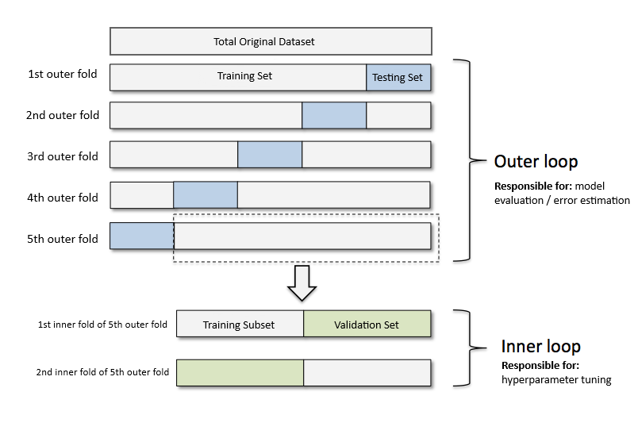
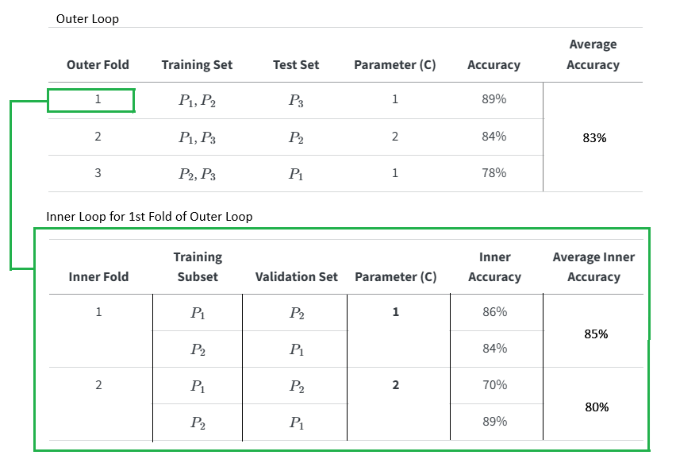

# Simulation Study Bates 2023

## Paper Overview of Simulation Study (Bates 2023)
This section summarizes the simulation study discussed in Cross-validation: what does it estimate and how well does it do it?, [@Bates2023].

* **Title:** Cross-validation: what does it estimate and how well does it do it?
* **Author:** Stephen Bates, Trevor Hastie, and Robert Tibshiran
* **Journal:** Journal of the American Statistical Association

## Central Goal of Study:
Insert here

## Problem and Proposed Solution:
| Topic | Common Assumption | Mathematical Reality / Discovery |
| :--- | :--- | :--- |
| **Target of Estimation** | Estimates the prediction error of *your specific fitted model*. | Estimates the *average error* of models fit on other unseen datasets from the same population. |
| **Uncertainty / Confidence Intervals** | Standard formulas give reliable error ranges. | Standard ranges are **too narrow** due to recycled data inducing hidden correlations. |
| **Solution** | Traditional Cross-Validation | **Nested Cross-Validation** corrects the variance estimate and provides accurate coverage. |
| **Data Splitting Warning** | Re-fitting the final model on combined data is harmless. | Re-fitting **invalidates** the calculated confidence intervals. |

## Hyperparameter Tuning:
* Hyperparameter tuning refers to the action of choosing and fine-tuning parameter values for a given model that result in the minimal error / highest accuracy. 

## Nested Cross Validation:
* Outer Loop (Error Estimation): 
    - The total original dataset is split into $N$ number of outer folds where each fold is comprised of the training set and testing set.
    - The test set is held out exclusively for final model performance evaluation
* Inner Loop (Hyperparameter Tuning):
    - Take the training set from the outer loop and split it further into an inner training subset and a validation set.
    - The training subset in run on the model and then evaluated on the validation set. 
    - The model trains on the inner training subset across candidate hyperparameter values (these are the parameters we choose) and evaluate them on the inner validation set.
* Hyperparameter Tuning (Select Optimal Hyperparameters):
    - Compute the inner validation accuracy for each hyperparameter configuration and choose the parameter setting that minimizes error / maximizes accuracy for a given iteration.
    - We take the chosen parameters plus the entire training set as a whole then we run on the test set and evaluate its performance.
* Error estimation:
    - We take the average error on the training data
    - We take the average error on the testing data
    - This gives us the overall generalization error

* Example:
    - Assume we have 3-Fold CV with some hyperparamter C for some values 1 and 2 for some model.
    - Further assume we have 3 observations (P1, P2, P3) in a dataset.
    - We want to optimize the hyperparamter C. 
    - In this consider we only consider one inner loop for the 1st outer fold. 
    - We determine which combination yielded the highest accuracy / minimized error.

