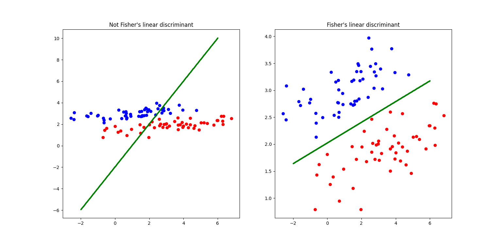
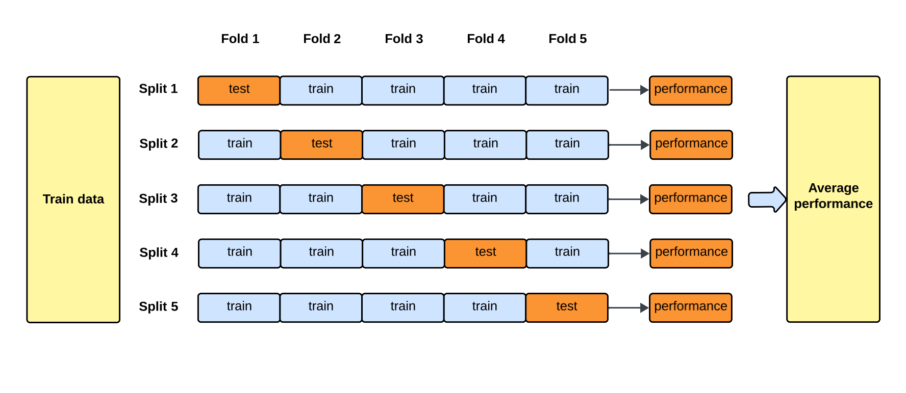
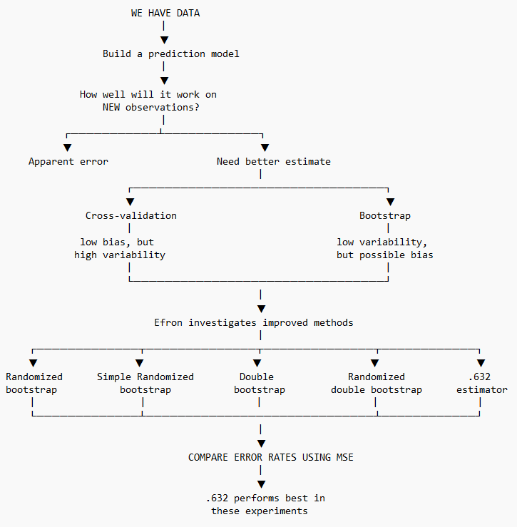
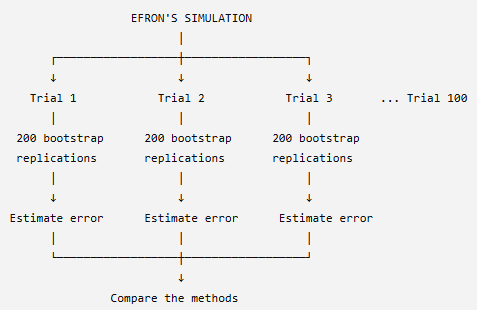
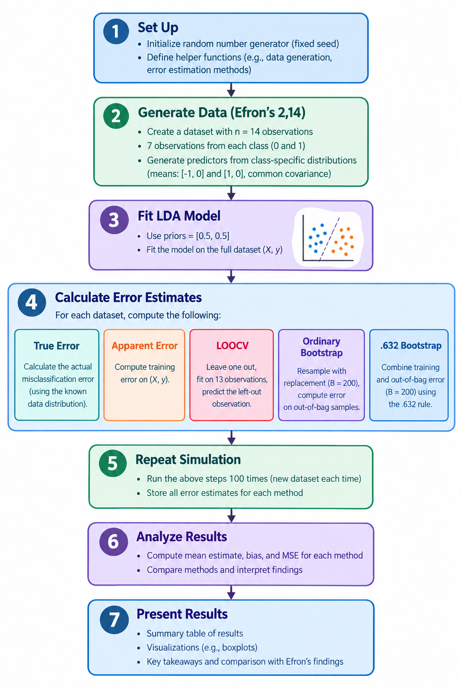

# Simulation Study

## Paper Overview of Simulation Study (Efron 1983)
This section summarizes the simulation study discussed in Estimating the Error Rate of a Prediction Rule: Improvement on Cross-Validation, [@Efron1983].

* **Title:** Estimating the Error Rate of a Prediction Rule: Improvement on Cross-Validation
* **Author:** Bradley Efron
* **Journal:** Journal of the American Statistical Association

### Central Goal of Study:
* This study aims to build a prediction rule that classifies data into two classes using generated data and creates a prediction model and estimates the likelihood of that model making an incorrect prediction when tested on data it has never seen before. This is the true error rate. The study leverages statisical techniques such as cross validation, various bootstrapping methods, etc. and compares their error rates to determine which method gives the best estimate of the true error rate. 

### Efron's Simulation Study Step-by-Step:
1. Efron uses a sampling experiment based on a specified probability model to generate artificial data for the simulation study.
    - For the sampling experiments such as the (2,14) sampling experiment, Efron generates data from a bivariate normal probability model with two predictor variables and two classes.
    - The simulated dataset generates binary classes with equal probability of 50% each: 
        * $P(Y = 0) = P(Y = 1) = 0.5$
    - Where predictor vectors follow [class-conditional bivariate normal distributions](bivariate_norm_dist.qmd): 
        * $X \mid Y=0 \sim \mathcal{N}_2((-1,0)^T, \mathbf{I})$ 
        * $X \mid Y=1 \sim \mathcal{N}_2((1,0)^T, \mathbf{I})$
2. Efron uses the resulting training data to construct a classification rule using Fisher's linear discriminant. This prediction rule attempts to separate observations into their respective classes and is then used to predict the class of new observations.
3. The apparant error rate is calculated which is used as a in-sample baseline to quantify optimism.
4. Since Efron generated the data, he calculated true rror rate which is used for comparison. (In pratice, we typically would not know the true error rate).
5. The specific method such as cross validation, bootstrapping, etc., is then used to test how well that classifier predicts unseen observations.
6. Efron then compares the error rates from the different methods like cross validation, bootstrapping, etc. and determines which method is the best estimator of the true error rate.
    - For a Single Trial (Trial $i$ of 100) the estomated error rates for each method are:
        * $\bar{e}rr_i$ (Apparent Error Rate)
        * $\text{Err}_i$ (True Error Rate)
        * $\widehat{\text{Err}}_{i, \text{LOOCV}}$
        * $\widehat{\text{Err}}_{i, \text{Boot}}$
        * $\widehat{\text{Err}}_{i, \text{RBoot}}$
        * $\widehat{\text{Err}}_{i, \text{SRBoot}}$
        * $\widehat{\text{Err}}_{i, \text{DBoot}}$
        * $\widehat{\text{Err}}_{i, \text{RDBoot}}$
        * $\widehat{\text{Err}}_{i, .632}$
7. He repeats this process 100 times, conducting 100 independent trials (generating 100 separate training datasets). For each trial, the true error rate ($\text{Err}$) and all estimated error rates ($\widehat{\text{Err}}$) are computed. The Mean Squared Error ($\text{MSE}$) is then calculated across these 100 trials to see which estimation method stays closest to the true error.
$$\text{MSE}(\widehat{\text{Err}}) = \frac{1}{100} \sum_{i=1}^{100} \Big( \widehat{\text{Err}}_i - \text{Err}_i \Big)^2$$

## Key Concepts
### Prediction Rule:
* A Prediction rule is a specific decision threshold, score cutoff, or constraint derived from a model to classify subjects or take action.
* In Efron's study, the prediction rule classifies data into two classes. 
    - For example, whether a patient will "survive" or "not survive"
    - The mathematical representation is given by:    

::: {.callout-note title="Definition: Indicator Loss"}
The **Indicator Loss** function $Q[y_i, \eta_i]$ measures whether a model's prediction matches the true binary outcome:

$$
Q[y_i, \eta_i] = \begin{cases} 
0 & \text{if } \eta_i = y_i \\ 
1 & \text{if } \eta_i \neq y_i 
\end{cases}
$$

* **$Q[y_i, \eta_i]$** — **Loss / Error Metric**  
  Measures the accuracy or correctness of the prediction for the $i$-th individual observation.

* **$y_i$** — **True Response**  
  The actual observed outcome for case $i$ (e.g., $1 = \text{survive}$, $0 = \text{not survive}$).

* **$\eta_i$** — **Predicted Value**  
  The value predicted by the model for case $i$, where $\eta_i = \eta(t_i, \mathbf{x})$.

* **$t_i$** — **Predictor Vector**  
  The set of input features or covariates for case $i$ (e.g., patient age, medical history).

* **$\mathbf{x}$** — **Training Set**  
  The entire collection of training data $\mathbf{x} = (x_1, x_2, \dots, x_n)$ used to construct the prediction rule $\eta$.

* **$0 \text{ vs. } 1$** — **Indicator Loss**  
  * **$0$**: Correct prediction ($\eta_i = y_i$). No error penalty.  
  * **$1$**: Misclassification ($\eta_i \neq y_i$). Standard binary classification error penalty.

:::

### Error Rate:
* True error rate $(Err)$ refers to the likelihood/probability of the model/prediction rule making the incorrect predicition when tested on data it was not trained on.

::: {.callout-note title="Definition: True Error Rate"}
The **True Error Rate ($\text{Err}$)** is the expected loss when applying the fixed prediction rule $\eta(t, \mathbf{x})$ to an unseen, randomly selected future observation $X_0$:

$$
\text{Err} = E\Big[Q[Y_0, \eta(T_0, \mathbf{x})]\Big]
$$

* **$\text{Err}$** — **True Error Rate**  
  The theoretical out-of-sample error rate (generalization error) of the trained model on future unseen data.

* **$E[\,\cdot\,]$** — **Expectation Operator**  
  The expected value (or probability of misclassification) evaluated over the true joint distribution of a new observation $(T_0, Y_0)$.

* **$X_0 = (T_0, Y_0)$** — **Unobserved Future Case**  
  A new, independent data point drawn from the underlying distribution, consisting of predictor vector $T_0$ and true response $Y_0$.

* **$\eta(T_0, \mathbf{x})$** — **Model Prediction for Future Case**  
  The prediction generated for predictor $T_0$ using the fixed rule trained on dataset $\mathbf{x}$.

* **$Q[\,\cdot\,,\,\cdot\,]$** — **Indicator Loss**  
  Returns $1$ if the prediction fails ($\eta(T_0, \mathbf{x}) \neq Y_0$) and $0$ if correct.

:::

* Apparent error rate $(\bar{e}rr)$ refers to the likelihood/probability of the model/prediction rule making the incorrect predicition when tested on the same data it already trained on. The apparemnt error often gives misleading results that are too optimistic since the model has already "seen the answer before" so it did not actually "learn the material."

::: {.callout-note title="Definition: Apparent Error Rate"}
The **Apparent Error Rate ($\bar{e}rr$)** is the empirical error rate calculated by evaluating the prediction rule directly on the same dataset used to train it:

$$
\bar{e}rr = \frac{1}{n} \sum_{i=1}^{n} Q[y_i, \eta(t_i, \mathbf{x})]
$$

* **$\bar{e}rr$** — **Apparent Error Rate**  
  The in-sample training error rate observed across the training set.

* **$n$** — **Sample Size**  
  The total number of observations in the training set $\mathbf{x}$.

* **$\sum_{i=1}^{n}$** — **Summation**  
  Sums the loss across all individual training cases $i = 1, 2, \dots, n$.

* **$y_i$** — **Observed Response**  
  The actual response variable for the $i$-th training observation.

* **$\eta(t_i, \mathbf{x})$** — **In-Sample Prediction**  
  The prediction made for training input $t_i$ using the rule derived from training set $\mathbf{x}$.

* **$\bar{e}rr < \text{Err}$** — **Optimism Bias**  
  Because the same data is used both to fit and evaluate $\eta(t, \mathbf{x})$, $\bar{e}rr$ is typically overly optimistic (underestimates the true error).

:::

* Optimism (op) measures the diffference between the true error rate and the apparent error rate.

::: {.callout-note title="Definition: Optimism"}
The **Optimism (op)** is the random variable representing the difference between the true error rate and the apparent error rate for a given training set $\mathbf{x}$:
$$
\text{op} = \text{Err} - \bar{e}rr
$$
The expected value of optimism over all possible training sets drawn from distribution $F$ is denoted by $\omega(F)$:

$$
\omega(F) = E_F\{\text{op}(\mathbf{X}, F)\} = E_F\big\{\text{Err}(\mathbf{X}, F) - \bar{e}rr(\mathbf{X})\big\} \tag{2.5}
$$

* **$\text{op}(\mathbf{x}, F)$** — **Optimism (Random Variable)**  
  The realization of the gap between true generalization error and training error for a specific realized training dataset $\mathbf{x}$.

* **$\omega(F)$** — **Expected Optimism**  
  The theoretical average optimism over all datasets $\mathbf{X}$ sampled from the population probability distribution $F$.

* **$F$** — **True Data Generating Distribution**  
  The underlying joint probability distribution of the data from which observations are sampled.

* **$\text{Err}(\mathbf{X}, F)$** — **True Error Rate**  
  The expected loss of the model when applied to unseen future test cases sampled from $F$.

* **$\bar{e}rr(\mathbf{X})$** — **Apparent Error Rate**  
  The empirical error rate calculated directly on the training dataset $\mathbf{X}$.

* **$E_F\{\,\cdot\,\}$** — **Expectation under $F$**  
  The expected value taken over the random variation of the training dataset $\mathbf{X}$ generated by distribution $F$.

:::

### Fisher's Linear Discriminant:
* Fisher's linear discriminant is a classification method used as a prediction rule where given an observation or data point, decide which group/class it belongs to. 
* Fisher's linear discriminat tries to find a linear boundary that separates the two classes as well as possible.
* Efron utilzes the FIsher's linear discriminant as the prediction rule for this study.



### Cross Validation:
* Cross-validation is a technique used to estimate how well a prediction model will perform on new, unseen data. It does this by dividing the available data into training and testing portions multiple times, fitting the model using the training portion, and evaluating its performance on the testing portion.
* A fold of data refers to a chunk/subset of data.
* The data is divided into k number equally-sized folds. During each iteration, k-1 number of folds of data are used for for training and the remaining 1 fold of data is used for testing. This is referred to a k-fold cross validation.
* Cross Validation looks at the average of the performance scores from all iterations to get a final accuracy metric.
* Cross Validation then compares the results across various models where each model sees the exact same folds to detmerine which model works best using the specific fold combination. 



* Additional information about Cross Validation can be referenced in the [Cross Validation Chapter](cross_validation.qmd).

### Bootstrapping:
* Bootstrapping works by resampling a single dataset repeatedly with replacement (known as sampling with replacement) to estimate the variability, bias, or uncertainty of a statistic or estimator.
* Bootstrapping takes a fixed original dataset of n number of observations.
* Randomly draws a data points from the original dataset with replacement where a single data point from the original dataset may be picked more than once while some data points from the original dataset may not be picked at all. 
* This process is done until a new dataset is created known as the bootstrapped dataset with the same n number of data points as the original dataset.
* This process is then repeated multiple times, producing multiple bootstrapped datasets.
* The statisics for each of the bootstrapped datasets are taken.


* Additional information about bootstrapping can be referenced in the [Bootstrapping Chapter](boostrapping.qmd).

### Mean Squared Error (MSE):
* The MSE is the average of the squared differences between actual values and predicted values. 
* In Efron's study it is the squared difference between the true error rate and the estimated error rate. The formula used for the MSE for comparing both error rates is given by:
$$
MSE = E(\widehat{Err} - Err)^2
$$
Where: 
$$
\widehat{Err} = \text{the estimated error rate}
$$
$$
Err = \text{the true error rate}
$$

### Bias Vs. Variance:
* Bias measures how far off a model's average predictions are from the correct values. Bias is the error from making oversimplified assumptions, leading to underfitting. 
    - Underfitting refers to when the model is too simple to capture the underlying or key patterns in the data, resulting in poor performance on both training and testing datasets.
* Variance measures how much a model's predictions change if you train it on a different data subset. Variance is the error from the model being too sensitive to small changes in training data, leading to overfitting. 
    - Overfitting refers to when the model learns the training data too well, is overly complex, sensitive, and flexible, resulting in the memorization of random noise and minor quirks instead of the true underlying or key patterns.
* For a good and reliable model, an optimal balance between simplicity and complexity, and thus, a low bias and low variance is required. 
    - As model complexity increases, bias goes down and variance goes up.
    - As model simplicity increases, bias goes up and variance goes down.


## Simulation Study Procedure Defined in Efron 1983

### Sampling Experiements Used:
* **Sampling Experiment #1 - (2, 14):**
    - 2 predictors - 2 independent variables
    - 14 observations - sample size of 14
    - 100 trials - the experiement was repreated 100 times
    - For example: visualize the data as a matrix

    | Observation | Variable 1 $(X_1)$ | Variable 2 $(X_2)$ | Class $(Y)$ |
    | ----------- | -----------------: | -----------------: | ----------- |
    | 1           |                 22 |                 35 | A           |
    | 2           |                 31 |                 52 | B           |
    | 3           |                 27 |                 41 | A           |
    | ...         |                ... |                ... | ...         |
    | 14          |                 45 |                 75 | B           |

* **Sampling Experiment #2 - (2, 20):**
    - 2 predictors - 2 independent variables
    - 20 observations - sample size of 20 (allows Efron to see what happens when sample size increases)
    - 100 trials - the experiement was repreated 100 times
    - For example: visualize the data as a matrix

    | Observation | Variable 1 $(X_1)$ | Variable 2 $(X_2)$ | Class $(Y)$ |
    | ----------- | -----------------: | -----------------: | ----------- |
    | 1           |                 22 |                 35 | A           |
    | 2           |                 31 |                 52 | B           |
    | 3           |                 27 |                 41 | A           |
    | ...         |                ... |                ... | ...         |
    | 20          |                 56 |                 67 | A           |

* **Sampling Experiment #3 -(5, 14):**
    - 5 predictors - 5 independent variables (allows Efron to see what happens when the number of predictors increase)
    - 14 observations - sample size of 14 
    - 100 trials - the experiement was repreated 100 times
    - For example: visualize the data as a matrix

    | Observation | $(X_1)$ | $(X_2)$ | $(X_3)$ | $(X_4)$ | $(X_5)$ | Class |
    | ----------- | ------: | ------: | ------: | ------: | ------: | ----- |
    | 1           |     ... |     ... |     ... |     ... |     ... | A     |
    | 2           |     ... |     ... |     ... |     ... |     ... | B     |
    | 3           |     ... |     ... |     ... |     ... |     ... | A     |
    | ...         |     ... |     ... |     ... |     ... |     ... | ...   |
    | 14          |     ... |     ... |     ... |     ... |     ... | A     |

* **Sampling Experiment #4 - (5, 20):**
    - 5 predictors - 5 independent variables (allows Efron to see what happens when the number of predictors increase)
    - 20 observations - sample size of 20 (allows Efron to see what happens when sample size increases)
    - 100 trials - the experiement was repreated 100 times
    - For example: visualize the data as a matrix

    | Observation | $(X_1)$ | $(X_2)$ | $(X_3)$ | $(X_4)$ | $(X_5)$ | Class |
    | ----------- | ------: | ------: | ------: | ------: | ------: | ----- |
    | 1           |     ... |     ... |     ... |     ... |     ... | A     |
    | 2           |     ... |     ... |     ... |     ... |     ... | B     |
    | 3           |     ... |     ... |     ... |     ... |     ... | A     |
    | ...         |     ... |     ... |     ... |     ... |     ... | ...   |
    | 20          |     ... |     ... |     ... |     ... |     ... | B     |

* **Sampling Experiment #5 - Gong:**
    - 4 predictors
    - 20 observations
    - 171 trials
    - logistic regression
    - forward stepwise variable selection

### Models/Techniques Used:

* **Cross Validation:**
    - Efron used Leave-One-Out Cross-Validation (LOOCV), in which each observation is removed from the dataset one at a time. A prediction rule is then fitted using the remaining observations and used to predict the observation that was left out. The prediction is recorded as either correct or incorrect, and this process is repeated for every observation. The proportion of incorrect predictions provides an estimate of the model's prediction error on observations that were not used to fit the prediction rule.

    - **Example to visualize the LOOCV technique:** Suppose we have four observations belonging to one of two classes, 0 or 1. In each round of LOOCV, one observation is held out as the test observation, while the remaining three observations are used to fit the prediction rule. The fitted rule then predicts the class of the held-out observation.

    | Iteration | Training Data | Testing Data | Predicted | Correct?  | Error |
    | --------- | ------------- | ------------ | --------- | --------- | ----: |
    | 1         | 2, 3, 4       | **1**        | 0         | No        |     1 |
    | 2         | 1, 3, 4       | **2**        | 1         | Yes       |     0 |
    | 3         | 1, 2, 4       | **3**        | 1         | No        |     1 |
    | 4         | 1, 2, 3       | **4**        | 0         | Yes       |     0 |

    - The LOOCV error rate estimate is calculated as the proportion of incorrect predictions across all four iterations:
    $$
    \text{LOOCV Error Rate} = \frac{1 + 0 + 1 + 0}{4} = 0.50
    $$
    - Therefore, the estimated error rate using LOOCV is **50%**.

* **Ordinary Bootstrap:**
    - Efron used ordinary boostrapping to create new aritifical datasets by randomly sampling from the original dataset with replacement where the original dataset is used to represent the population. 
    - Efron ran 200 bootstrap replications per trial.
    - The ordinary bootstrap error rate estimate is calcuated by estimateing the optimism of the apparent error:
    $$
    \widehat{Err}^\text{BOOT} = \bar{e}rr + \bar{op}^\text{BOOT}
    $$


* **Randomized Bootstrap:**
    - Efron used a modified version of the ordinary bootstrap which uses the same process of an ordinary bootstrap but the only idfference is that the observations are not treated as having completely certain classifications (randomized).

* **Double Bootstrap:**
    - Efron's double bootstrap applies a second bootstrap correction to the ordinary bootstrap estimator in order to correct the downward bias of the ordinary bootstrap estimate.

* **Simple Randomized Bootstrapping**
    - A simplified version of Efron's randomized bootstrap that modifies the empirical distribution by assigning probability to both possible class labels associated with each predictor vector. It is still evaluated using repeated bootstrap replications.

* **Randomized Double Bootstrapping**
    - Is a double boostrapping but its observations are not treated as having completely certain classifications (randomized).

* **.632 Estimator:**
    - Efron used the .632 estimator which is a bootsrapping method that performs the same procedures as an ordinary bootstrap where 63.2% of the original obersevations appear in the bootstrap sample and 36.8% of the original oberservations are left out of the bootstrap sample. The .632 estimator commbine the apparent error and the bootstrap error, giving more weight to the bootstrap error which Efron originally found to have a downward bias.
    - The .632 estimator combines the apparent error rate with the out-of-bag error rate which refers to the bootstrap error calculated on observations that were not included in a particular bootstrap training sample. These out-of-bag observations receive the larger 0.632 weight.
    - **Example to visualize the .632 Estimator technique:** Think of the .632 estimator as balancing two imperfect estimates: the apparent error may be too optimistic because the model has already seen the data, while the bootstrap error is based on observations the model did not see. The .632 estimator therefore gives more weight to the bootstrap error while still incorporating the apparent error. Consider an exmaple where the apparent error rate is found to be 10% and the ordinary bootstrap error rate is foudn to be 25%. The rror rate of the .632 estimator is calculated using the following formula:

$$
\widehat{Err}_{.632}
=
0.368(\bar{e}rr)
+
0.632(e^{(0)})
$$

So the .632 estimator gives:

- **36.8% weight** to apparent error ($\bar{e}rr$)
- **63.2% weight** to out-of-bag error rate ($e^{(0)}$)

For example, suppose:

$$
\text{Apparent error} = 10\%
$$

and

$$
\text{Out-of-bag error rate} = 25\%
$$

Then:

$$
\widehat{Err}_{.632}
=
(0.368)(10\%) + (0.632)(25\%)
$$

$$
= 3.68\% + 15.8\%
$$

$$
= 19.48\%
$$
Therefore, the .632 estimator gives an estimated prediction error of **19.48%**.

### Results:
* **Cross Validation Findings:**
    - Efron finds that cross-validation is fairly unbiased, meaning that its estimated error tends to be close to the true prediction error on average or that its results tend to be around the correct answer. However, cross validation is highly variable for small sample sizes of data. With fewer observations, individual data points can have a larger influence on the fitted prediction rule, causing the estimated error rate to vary more from one sample to another. Therefore, while cross-validation can provide a relatively accurate estimate on average, a single cross-validation estimate may not be very stable.

* **Ordinary Bootstrapping Findings:**
    - Efron finds that ordinary bootstrapping has relatively low variability but has a significant downward bias, meaning, the model consistently underestimates the true error rate. 

* **Randomized bootstrap Findings:**
    - The ordinary boostrap estimate underestimates true error (downward bias) because it underestimates optimism. So, the double boostrap estimate intended to correct this by estimating the bias of the optimism estimate itself.
    - Found to be the second-best method overall in the sampling experiments.

* **Double bootstrap Findings:**
    - The double bootstrap successfully corrected the ordinary bootstrap's bias, although its MSE was about the same as the ordinary bootstrap.

* **.632 Estimator Findings:**
    - The .632 estimator performed best in the sampling experiments. However, this method had the weakest theoretical justification and therefore recommended it with caution pending additional research.

* **Simple Randomized Bootstrapping**
    - Found to perform well.

* **Randomized Double Bootstrapping**
    - FOund to perform very well.

## Efron's Simulation Study Design


## Student Simulation of Sampling Experiment (2,14)
### Student Presentation Plan:
1. I will replicate one of the simulation experiments from Efron's paper, focusing on the (2,14) experiment. In this experiment, Efron considers a prediction problem with two predictor variables and a training sample of 14 observations. 
2. I will generate data according to the simulation setup described in the paper for the (2,14) sampling experiments which used a bivariate normal probability model with two predictor variables and two classes.
3. Similar to Efron, I will conduct 100 trials of sampling experiment (2,14) which will geenerate 100 artificial datasets. 
4. I will construct the prediction rule using the FIsher's Linear Discriminant.
5. I will evaluate the apparent error rate to use as a baseline for my comparisons.
6. I will then estimate its error rate using the leave-one-out cross validation, ordinary bootstrap, and .632 estimator methods. 
7. I will conduct 200 bootstrap replications per trial for ordinary bootstrapping.



8. I will then compare the estimated error rates with the true error rate across repeated simulations to investigate how accurately each method estimates prediction error. This will be done by calcuating the MSE.
9. I will utilize Python as my primary programming lanagauge to complete this simulation.
    - I will use the numpy package to generate my data and then utilizing the sampling experiemnts referenced in the paper to define the paremeters for each dataset.
    - I will be using the scikit-learn package to run my various models (cross validiaiton, bootstrapping, etc.), create my linear discriminant analysis for my prediction rule, and to create my MSE for comparing the estimated error rates of each method with the true errro rate.
    - I will use scipy to construct statistical equations.



### Simulation Study Code:

```{python}

# importing necessary libraries
import numpy as np 
import pandas as pd
import matplotlib.pyplot as plt

from scipy.stats import norm # importing the normal distribution from scipy.stats
from sklearn.discriminant_analysis import LinearDiscriminantAnalysis # importing the Linear Discriminant Analysis model from sklearn
from sklearn.model_selection import LeaveOneOut # importing the Leave-One-Out cross-validation method from sklearn
```

```{python}

# creating a random number generator with a fixed seed for reproducibility
rng = np.random.default_rng(seed=100)

# creating a function to generate the dataset for Efron's (2,14) sampling experiment
def generate_214_data(n=14, rng=None):
    """
    Generate one dataset for Efron's (2,14) sampling experiment.

    Parameters
    ----------
    n : int
        Number of observations in the training dataset.
        Efron's (2,14) experiment uses n = 14.

    rng : numpy.random.Generator
        Random number generator used for reproducibility.

    Returns
    -------
    X : numpy.ndarray
        Predictor matrix with shape (n, 2).

    y : numpy.ndarray
        Binary class labels with shape (n,).
    """

    # Create a random number generator if one was not provided
    if rng is None:
        rng = np.random.default_rng()

    # Step 1: Generate class labels.
    # Each observation independently has a 50% probability
    # of belonging to either class.
    y = rng.binomial(
        n=1,
        p=0.5,
        size=n
    )

    # Step 2: Create an empty array for two predictors.
    X = np.zeros((n, 2))

    # Mean vector for Class 0
    mean_class_0 = np.array([-1.0, 0.0])

    # Mean vector for Class 1
    mean_class_1 = np.array([1.0, 0.0])

    # Identity covariance matrix
    covariance = np.eye(2)

    # Step 3: Generate predictor values conditional on class.
    for i in range(n):

        if y[i] == 0:
            X[i] = rng.multivariate_normal(
                mean=mean_class_0,
                cov=covariance
            )

        else:
            X[i] = rng.multivariate_normal(
                mean=mean_class_1,
                cov=covariance
            )

    return X, y
```

```{python}
# Generate the dataset for Efron's (2,14) sampling experiment
X, y = generate_214_data(
    n=14,
    rng=rng
)
```

```{python}
# Display the shapes of the generated predictor matrix and class labels
print("Shape of X:", X.shape)
print("Shape of y:", y.shape)
```

```{python}
# Create a DataFrame to see the simulated data
simulated_data = pd.DataFrame(
    {
        "Predictor_1 (X_1)": X[:, 0],
        "Predictor_2 (X_2)": X[:, 1],
        "Class labels": y
    }
)

simulated_data
```

```{python}
# Visualize the simulated dataset using a scatter plot
plt.figure(figsize=(7, 5))

for class_value in [0, 1]:

    plt.scatter(
        X[y == class_value, 0],
        X[y == class_value, 1],
        label=f"Class {class_value}"
    )

plt.xlabel("Predictor 1")
plt.ylabel("Predictor 2")
plt.title(
    "One Simulated Dataset from Efron's (2,14) Experiment"
)

plt.legend()

plt.show()
```

```{python}
# Create the Linear Discriminant Analysis model
lda_model = LinearDiscriminantAnalysis(
    priors=[0.5, 0.5]
)

# Fit the model using the simulated training data
lda_model.fit(X, y)
```

```{python}
# Predict the class of each training observation
predictions = lda_model.predict(X)

# Display the true classes and predicted classes
print("True classes:", y)

print("\nPredicted classes:", predictions)

# True if an observation was misclassified
misclassified = predictions != y

# Display the misclassified observations
print("\nMisclassified observations:", misclassified)
```

```{python}
# Calculate the apparent error rate
def apparent_error(X, y):
    """
    Calculate the apparent error rate.

    The LDA model is trained and evaluated on
    the same dataset.
    """

    # Create the LDA model
    model = LinearDiscriminantAnalysis(
        priors=[0.5, 0.5]
    )

    # Fit the model to the training data
    model.fit(X, y)

    # Predict the training observations
    predictions = model.predict(X)

    # Calculate proportion incorrectly classified
    error_rate = np.mean(
        predictions != y
    )

    return error_rate

# Calculate and print the apparent error rate for the simulated dataset
app_error = apparent_error(X, y)
print("Apparent Error Rate:", app_error)
```

```{python}
# Calculate the conditional true error of a fitted LDA model
def true_error_214(model):
    """
    Calculate the conditional true error of a fitted LDA model
    under Efron's (2,14) population model.
    """

    # Population means
    mu_0 = np.array([-1.0, 0.0])
    mu_1 = np.array([1.0, 0.0])

    # Identity covariance matrix
    covariance = np.eye(2)

    # Extract the fitted linear decision rule
    w = model.coef_[0]
    b = model.intercept_[0]

    # Standard deviation of the discriminant score
    score_sd = np.sqrt(
        w @ covariance @ w
    )

    # Mean discriminant score for each true class
    mean_score_0 = w @ mu_0 + b
    mean_score_1 = w @ mu_1 + b

    # Probability of misclassifying Class 0
    error_class_0 = norm.cdf(
        0,
        loc=mean_score_0,
        scale=score_sd
    )

    error_class_0 = 1 - error_class_0

    # Probability of misclassifying Class 1
    error_class_1 = norm.cdf(
        0,
        loc=mean_score_1,
        scale=score_sd
    )

    # Equal class priors
    true_error = (
        0.5 * error_class_0
        + 0.5 * error_class_1
    )

    return true_error

# Calculate the conditional true error of the fitted LDA model
lda_model = LinearDiscriminantAnalysis(
    priors=[0.5, 0.5]
)

# Fit the model using the simulated training data
lda_model.fit(X, y)

# Calculate the conditional true error of the fitted LDA model
true_error = true_error_214(lda_model)

# Print the conditional true error rate
print("Conditional True Error Rate:", true_error)
```

```{python}
# Create a DataFrame to compare the apparent error rate and true error rate
comparison = pd.DataFrame({
    "Method": [
        "Apparent Error",
        "True Error"
    ],
    "Estimated Error": [
        app_error,
        true_error
    ]
})

comparison
```

```{python}
# Leave-One-Out Cross-Validation (LOOCV)
"""
With 14 observations:
    1. Leave out observation 1.
    2. Train LDA on the other 13 observations.
    3. Predict observation 1.
    4. Record whether it was correct.
    5. Repeat until every observation has been left out once.
    6. Calculate the proportion of the 14 predictions that were incorrect.
"""

# Create the Leave-One-Out cross-validation object
loo = LeaveOneOut()

# Loop through each observation, leaving one out at a time
for train_index, test_index in loo.split(X):
    print("Training indices:", train_index) # Indices of the training set
    print("Test index:", test_index) # Index of the test set
```

```{python}
# Calculate the Leave-One-Out Cross-Validation error rate
def loocv_error(X, y):
    """
    Calculate the Leave-One-Out Cross-Validation
    error rate for Fisher's Linear Discriminant Analysis.
    """

    # Create the LOOCV splitter
    loo = LeaveOneOut()

    # Store whether each left-out observation
    # was classified incorrectly
    errors = []

    # Repeat once for every observation
    for train_index, test_index in loo.split(X):

        # Create training data containing 13 observations
        X_train = X[train_index]
        y_train = y[train_index]

        # Create the one-observation test dataset
        X_test = X[test_index]
        y_test = y[test_index]

        # Create the LDA prediction rule
        model = LinearDiscriminantAnalysis(
            priors=[0.5, 0.5]
        )

        # Train on the 13 observations
        model.fit(X_train, y_train)

        # Predict the observation that was left out
        prediction = model.predict(X_test)

        # Record whether the prediction was incorrect
        errors.append(
            prediction[0] != y_test[0]
        )

    # Calculate the proportion incorrectly classified
    return np.mean(errors)

# Calculate and print the LOOCV error rate for the simulated dataset
cv_error = loocv_error(X, y)
print("LOOCV Error Rate:", cv_error)

# Create a function to return the LOOCV predictions for each observation
def loocv_predictions(X, y):

    loo = LeaveOneOut()

    results = []

    for train_index, test_index in loo.split(X):

        X_train = X[train_index]
        y_train = y[train_index]

        X_test = X[test_index]
        y_test = y[test_index]

        model = LinearDiscriminantAnalysis(
            priors=[0.5, 0.5]
        )

        model.fit(X_train, y_train)

        prediction = model.predict(X_test)

        results.append({
            "Observation": test_index[0],
            "True Class": y_test[0],
            "Predicted Class": prediction[0],
            "Correct": prediction[0] == y_test[0]
        })

    # Convert the results to a DataFrame for better visualization
    return pd.DataFrame(results)

# Generate the LOOCV predictions for the simulated dataset
loocv_results = loocv_predictions(X, y)
loocv_results
```

```{python}
# Create a DataFrame to compare the true error, apparent error rate, and LOOCV error rate
comparison = pd.DataFrame({
    "Method": [
        "True Error",
        "Apparent Error",
        "LOOCV"
    ],
    "Error Rate": [
        true_error,
        app_error,
        cv_error
    ]
})

comparison
```

```{python}
# Ordinary Boostrapping
"""
Start with the original 14 observations:
    1. Sample 14 observations with replacement.
    2. Fit Fisher's discriminant to the bootstrap sample.
    3. Evaluate the rule against the original observations.
    4. Repeat this 200 times (B=200 bootstrap replications per trial).
    5. Average the bootstrap results.
"""

# generate one bootstrap sample of the training data

# Number of observations
n = len(y)

# Sample 14 indices with replacement
bootstrap_indices = rng.choice(
    n,
    size=n,
    replace=True
)

print("Bootstrap indices:")
print(bootstrap_indices)
```

```{python}
# Create the bootstrap sample of the training data
X_boot = X[bootstrap_indices]
y_boot = y[bootstrap_indices]

# Display the shapes of the bootstrap predictor matrix and class labels
print("Shape of X_boot:", X_boot.shape)
print("Shape of y_boot:", y_boot.shape)

# Fit the LDA model to the bootstrap sample
bootstrap_model = LinearDiscriminantAnalysis(
    priors=[0.5, 0.5]
)

bootstrap_model.fit(
    X_boot,
    y_boot
)

# Predict class labels for the bootstrap sample
bootstrap_predictions = bootstrap_model.predict(
    X_boot
)

# Calculate the error rate on the bootstrap sample
error_on_bootstrap = np.mean(
    bootstrap_predictions != y_boot
)

# Print the error rate on the bootstrap sample
print(
    "Error on bootstrap sample:",
    error_on_bootstrap
)

# Calculate the error rate on the original dataset using the bootstrap model
original_predictions = bootstrap_model.predict(X)

# Calculate the error rate on the original dataset
error_on_original = np.mean(
    original_predictions != y
)

# Print the error rate on the original dataset
print(
    "Error on original data:",
    error_on_original
)

# Calculate the bootstrap optimism
bootstrap_optimism = (
    error_on_original
    -
    error_on_bootstrap
)

# Print the bootstrap optimism
print(
    "Bootstrap optimism:",
    bootstrap_optimism
)
```

```{python}
# Create function to estimate prediction error using Efron's ordinary bootstrap optimism correction
def ordinary_bootstrap_error(X, y, B=200, rng=None):
    """
    Estimate prediction error using Efron's ordinary
    bootstrap optimism correction.

    Only bootstrap samples containing both classes are used
    because LDA requires at least two classes.

    Parameters
    ----------
    X : numpy.ndarray
        Predictor matrix.

    y : numpy.ndarray
        Class labels.

    B : int
        Number of bootstrap replications.
        Efron's (2,14) experiment uses B = 200.

    rng : numpy.random.Generator
        Random number generator.
    """

    # Create random number generator if needed
    if rng is None:
        rng = np.random.default_rng()

    n = len(y)

    # --------------------------------------------------
    # Fit LDA to the original dataset
    # --------------------------------------------------

    original_model = LinearDiscriminantAnalysis(
        priors=[0.5, 0.5]
    )

    original_model.fit(X, y)

    original_predictions = original_model.predict(X)

    apparent_err = np.mean(
        original_predictions != y
    )

    # --------------------------------------------------
    # Store bootstrap optimism values
    # --------------------------------------------------

    optimism_values = []

    valid_replications = 0

    # --------------------------------------------------
    # Continue until we have B valid bootstrap samples
    # --------------------------------------------------

    while valid_replications < B:

        # Sample n observations with replacement
        indices = rng.choice(
            n,
            size=n,
            replace=True
        )

        # Create bootstrap dataset
        X_boot = X[indices]
        y_boot = y[indices]

        # --------------------------------------------------
        # Check whether both classes are present
        # --------------------------------------------------

        if len(np.unique(y_boot)) < 2:

            # Skip this bootstrap sample
            continue

        # --------------------------------------------------
        # Fit LDA to bootstrap sample
        # --------------------------------------------------

        bootstrap_model = LinearDiscriminantAnalysis(
            priors=[0.5, 0.5]
        )

        bootstrap_model.fit(
            X_boot,
            y_boot
        )

        # --------------------------------------------------
        # Error on bootstrap sample
        # --------------------------------------------------

        predictions_boot = bootstrap_model.predict(
            X_boot
        )

        error_boot = np.mean(
            predictions_boot != y_boot
        )

        # --------------------------------------------------
        # Error on original dataset
        # --------------------------------------------------

        predictions_original = bootstrap_model.predict(
            X
        )

        error_original = np.mean(
            predictions_original != y
        )

        # --------------------------------------------------
        # Bootstrap optimism
        # --------------------------------------------------

        optimism = (
            error_original
            -
            error_boot
        )

        optimism_values.append(
            optimism
        )

        # Count valid bootstrap replication
        valid_replications += 1

    # --------------------------------------------------
    # Average optimism
    # --------------------------------------------------

    average_optimism = np.mean(
        optimism_values
    )

    # --------------------------------------------------
    # Correct apparent error
    # --------------------------------------------------

    bootstrap_error = (
        apparent_err
        +
        average_optimism
    )

    return bootstrap_error

# Calculate the bootstrap estimate of prediction error using Efron's ordinary bootstrap optimism correction
bootstrap_error = ordinary_bootstrap_error(
    X,
    y,
    B=200,
    rng=rng
)

# Print the bootstrap estimate of prediction error
print(
    "Ordinary Bootstrap Error:",
    bootstrap_error
)
```

```{python}
results = pd.DataFrame({
    "Method": [
        "True Error",
        "Apparent Error",
        "LOOCV",
        "Ordinary Bootstrap"
    ],
    "Estimated Error": [
        true_error,
        app_error,
        cv_error,
        bootstrap_error
    ]
})

results
```

```{python}
# .632 estimator

# Count how many times each observation was selected
counts = np.bincount(
    bootstrap_indices,
    minlength=n
)

# True means the observation was not included
oob_mask = counts == 0

print("Out-of-bag observations:")
print(np.where(oob_mask)[0])

# Fit LDA and test only on the out-of-bag observations

# Create the bootstrap sample of the training data
X_boot = X[bootstrap_indices]
y_boot = y[bootstrap_indices]

# Check whether both classes are present in the bootstrap sample
if len(np.unique(y_boot)) >= 2:

    bootstrap_model = LinearDiscriminantAnalysis(
        priors=[0.5, 0.5]
    )

    bootstrap_model.fit(
        X_boot,
        y_boot
    )

    # Predict only observations that were left out
    oob_predictions = bootstrap_model.predict(
        X[oob_mask]
    )

    # Calculate error on the OOB observations
    oob_error = np.mean(
        oob_predictions != y[oob_mask]
    )

    print("Out-of-bag error:", oob_error)
```

```{python}
# Estimate prediction error using bootstrap out-of-bag observations
def bootstrap_oob_error(X, y, B=200, rng=None):
    """
    Estimate prediction error using bootstrap
    out-of-bag observations.

    Parameters
    ----------
    X : numpy.ndarray
        Predictor matrix.

    y : numpy.ndarray
        Class labels.

    B : int
        Number of valid bootstrap replications.

    rng : numpy.random.Generator
        Random number generator.

    Returns
    -------
    float
        Average out-of-bag classification error.
    """

    if rng is None:
        rng = np.random.default_rng()

    n = len(y)

    # Store all OOB errors
    oob_errors = []

    valid_replications = 0

    while valid_replications < B:

        # Generate bootstrap sample
        indices = rng.choice(
            n,
            size=n,
            replace=True
        )

        X_boot = X[indices]
        y_boot = y[indices]

        # Skip bootstrap samples containing one class
        if len(np.unique(y_boot)) < 2:
            continue

        # Identify out-of-bag observations
        counts = np.bincount(
            indices,
            minlength=n
        )

        oob_mask = counts == 0

        # Skip if no observations are OOB
        if not np.any(oob_mask):
            continue

        # Fit LDA to bootstrap sample
        model = LinearDiscriminantAnalysis(
            priors=[0.5, 0.5]
        )

        model.fit(
            X_boot,
            y_boot
        )

        # Predict OOB observations
        predictions = model.predict(
            X[oob_mask]
        )

        # Calculate OOB error
        error = np.mean(
            predictions != y[oob_mask]
        )

        oob_errors.append(error)

        valid_replications += 1

    # Average OOB error
    return np.mean(oob_errors)

# Estimate prediction error using bootstrap out-of-bag observations
oob_error = bootstrap_oob_error(
    X,
    y,
    B=200,
    rng=rng
)

print(
    "Bootstrap Out-of-Bag Error:",
    oob_error
)
```

```{python}
# Calculate the .632 bootstrap estimate of prediction error
def estimator_632(X, y, B=200, rng=None):
    """
    Calculate the .632 bootstrap estimate of prediction error.
    """

    # Calculate apparent error
    app_error = apparent_error(X, y)

    # Calculate out-of-bag error
    oob_error = bootstrap_oob_error(
        X,
        y,
        B=B,
        rng=rng
    )

    # Calculate .632 estimate
    error_632 = (
        0.368 * app_error
        + 0.632 * oob_error
    )

    return error_632

# Calculate the .632 bootstrap estimate of prediction error
error_632 = estimator_632(
    X,
    y,
    B=200,
    rng=rng
)

print(
    ".632 Bootstrap Error:",
    error_632
)
```

```{python}
# Create a DataFrame to compare the true error, apparent error rate, LOOCV error rate, ordinary bootstrap error, and .632 bootstrap error   
results = pd.DataFrame({
    "Method": [
        "True Error",
        "Apparent Error",
        "LOOCV",
        "Ordinary Bootstrap",
        ".632 Bootstrap"
    ],
    "Estimated Error": [
        true_error,
        app_error,
        cv_error,
        bootstrap_error,
        error_632
    ]
})

results

# Visualize the comparison of error rate estimates using a bar plot
plt.figure(figsize=(8, 5))

plt.bar(results["Method"], results["Estimated Error"])

plt.ylabel("Error Rate")
plt.xlabel("Method")
plt.title("Comparison of Error Rate Estimates")
plt.xticks(rotation=45)

plt.tight_layout()
plt.show()
```

```{python}
# conduct 100 trials for each method
all_results = []

for i in range(100):

    # Generate a new dataset
    X, y = generate_214_data(
        n=14,
        rng=rng
    )

    # Create the Linear Discriminant Analysis model
    lda_model = LinearDiscriminantAnalysis(
        priors=[0.5, 0.5]
    )
    
    # Fit the model using the simulated training data
    lda_model.fit(X, y)

    # Calculate true_error
    true_error = true_error_214(lda_model)
    # Calculate app_error
    app_error = apparent_error(X, y)
    # Calculate cv_error
    cv_error = loocv_error(X, y)
    # Calculate bootstrap_error
    bootstrap_error = ordinary_bootstrap_error(
        X,
        y,
        B=200,
        rng=rng
    )
    # Calculate error_632
    error_632 = estimator_632(
        X,
        y,
        B=200,
        rng=rng
    )

    all_results.append({
        "True Error": true_error,
        "Apparent Error": app_error,
        "LOOCV": cv_error,
        "Ordinary Bootstrap": bootstrap_error,
        ".632 Bootstrap": error_632
    })
```

```{python}
# Create a DataFrame to compare the true error, apparent error rate, LOOCV error rate, ordinary bootstrap error, and .632 bootstrap error after 100 trials
all_results = pd.DataFrame(all_results)

all_results
```

```{python}
# Calculate the bias of each method across all trials
bias = {
    "Apparent Error": (
        all_results["Apparent Error"] - all_results["True Error"]
    ).mean(),

    "LOOCV": (
        all_results["LOOCV"] - all_results["True Error"]
    ).mean(),

    "Ordinary Bootstrap": (
        all_results["Ordinary Bootstrap"] - all_results["True Error"]
    ).mean(),

    ".632 Bootstrap": (
        all_results[".632 Bootstrap"] - all_results["True Error"]
    ).mean()
}

# calculate the mean squared error of each method across all trials
mse = {
    "Apparent Error": np.mean(
        (all_results["Apparent Error"] - all_results["True Error"]) ** 2
    ),

    "LOOCV": np.mean(
        (all_results["LOOCV"] - all_results["True Error"]) ** 2
    ),

    "Ordinary Bootstrap": np.mean(
        (all_results["Ordinary Bootstrap"] - all_results["True Error"]) ** 2
    ),

    ".632 Bootstrap": np.mean(
        (all_results[".632 Bootstrap"] - all_results["True Error"]) ** 2
    )
}

# Create a summary DataFrame to compare the mean estimate, bias, and mean squared error of each method across all trials
summary = pd.DataFrame({
    "Mean Estimate": [
        all_results["Apparent Error"].mean(),
        all_results["LOOCV"].mean(),
        all_results["Ordinary Bootstrap"].mean(),
        all_results[".632 Bootstrap"].mean()
    ],
    "Bias": [
        bias["Apparent Error"],
        bias["LOOCV"],
        bias["Ordinary Bootstrap"],
        bias[".632 Bootstrap"]
    ],
    "MSE": [
        mse["Apparent Error"],
        mse["LOOCV"],
        mse["Ordinary Bootstrap"],
        mse[".632 Bootstrap"]
    ]
}, index=[
    "Apparent Error",
    "LOOCV",
    "Ordinary Bootstrap",
    ".632 Bootstrap"
])

summary
```

### Findings:
* LOOCV is very close to the true error on average, but it varies more from simulation to simulation. MSE captures both systematic bias and variability.
* Ordinary Bootstrap is slightly more biased than LOOCV, meaning it tends to underestimate the true error a little more on average. However, it has a lower MSE than LOOCV, suggesting that its estimates are somewhat more stable across simulations and have less overall squared error.
* .632 Bootstrap has a little more bias than LOOCV, but its estimates appear to have less overall squared error, giving it the lowest MSE.
* Apparent Error has substantially more negative bias than the other methods, meaning it tends to underestimate the true prediction error by a larger amount. Although its MSE is lower than LOOCV's, its relatively large bias shows that the training error is systematically too optimistic about performance on new data.